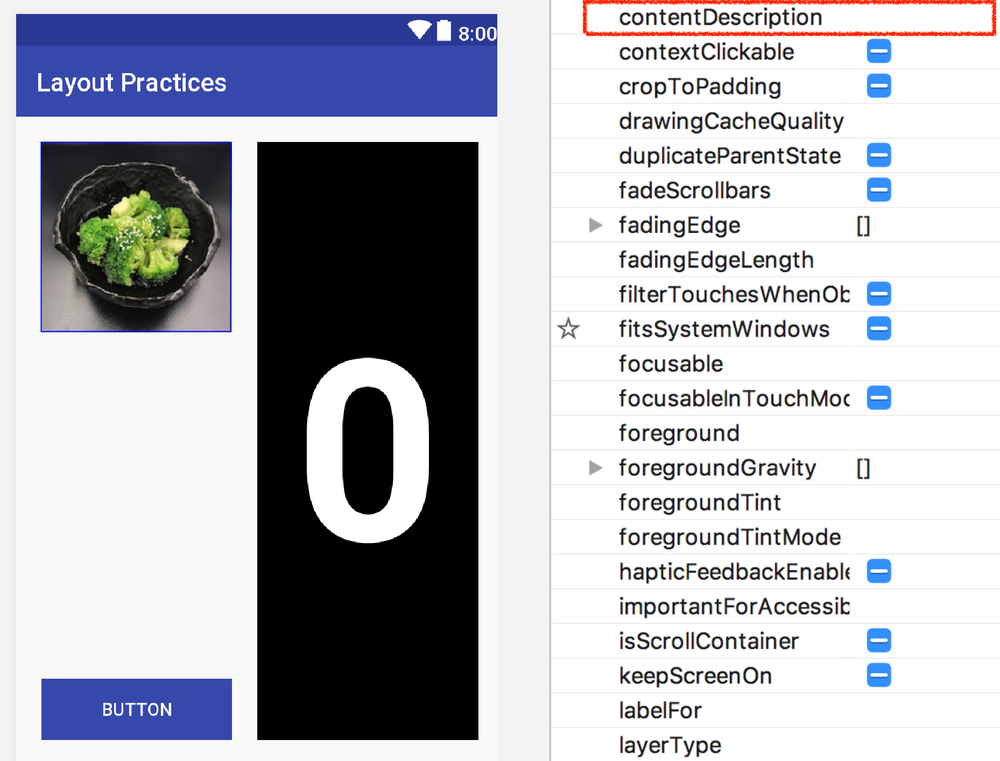

* TOC
{:toc}

# Accessibility Exercise

**Objective**: Identify and repair app accessibility issues.

**Learning Goals**:
- App accessibility
- Basics of Android assistive tools
- Understanding of different accessibility issues
- Simple repairs to accessibility issues

**Assigned Date**: ???, 2019

**Due Date**: ???, 2019

# Part 1

Tasks:
- Learn different categories of app accessibility issues
- Identify accessibility issues in our example app

Please read Table 2 on page 8 of [Epidemiology as a Framework for Large-Scale Mobile Application Accessibility Assessment](https://xiaoyizhang.me/assets/Paper/ASSETS_2017_Epidemiology.pdf)

For example: this image does not have contentDescription property. It is an "Item Label" error in the paper above. Therefore, screen reader cannot read the alternative text of the image to people with visual impairments.

{:width="500px"}

Our example app may not have ALL issues in the table. Try to identify as many issues as you can.

It is helpful to have basic understanding about [Talkback](https://support.google.com/accessibility/android/answer/6283677?hl=en) and [Switch Access](https://support.google.com/accessibility/android/answer/6122836?hl=en), two built-in assistive tools on Android.

Here are some guidelines of Android accessibility:
[Google Android Accessibility](https://developer.android.com/guide/topics/ui/accessibility/) / [Android Accessibility: Apps](https://developer.android.com/guide/topics/ui/accessibility/apps) / [Material Design: Accessibility](https://material.io/design/usability/accessibility.html#composition)

We will ask you to report all accessibility issues you identified. For each issue, you will identify the inaccessible UI element(s), indicate its issue type, and describe how to fix the issue.

<span style="color:red">
Should we ask them to write a report with the description of each issue? (Increases the workload of TA). Or we only grade based on how many issues are repaired? (What if they can identify but cannot repair some issues?)
</span>

<span style="color:red">
Should we provide them Google Accessibility Scanner? (Although it may not cover all issues...)
</span>

# Part 2

Tasks:
- Repair accessibility issues you identified in part 1

Once you identify an accessibility issue in the example app, please repair it by modifying code or xml layout file.

For example: To repair "Item Label" error above, we can either
- In layout editor, add "broccoli in a black bowl" as contentDescription property 
- In code, call method imageView.setContentDescription("broccoli in a black bowl")

# Turnin
## Submission Instructions

Please turn in your files in the following zip structure:

```bash
YOUR_STUDENT_ID.zip
├── MainActivity.java
└── content_main.xml
```

Please also submit accessibility issues report in *Google Form link placeholder*.

## Grading (10pts)

- Part 1
  - ???
- Part 2
  - ???
- Turn-in and compiles: 1pt
