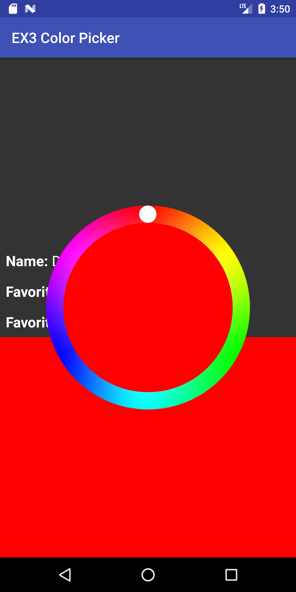

{:toc}

Tasks:

- Handle different input events in `onTouchEvent`
- Initialize properties during `onLayout` (register the first measure before initializing all views)
- Register callbacks
- Save activity state in bundle

# Touch Input Events

We'll handle touch input by implementing `onTouchEvent`. This is the event handler that will be called when a touch is registered in this view. First, we need to reject any touches that are outside of the circle. Colors may only be selected by tapping on or inside the color wheel.

<!-- <span style="color:red"> XXX TODO: Check edge case: e.g., drag and move outside wheel, the handle stays in 50% alpha (should be 100% alpha). I added examples in test to check alpha of handle to check state.</span> -->

<div class="mermaid">
graph LR
S((.)) --> A((Start))
A -- "Press?insideCircle:setAlpha(.75f)" --> I((Inside))
I -- "Release:setAlpha(1.00f), onColorSelected()" --> E[End]
I -- "Drag:setAlpha(.5f),updateHandle(),updateColor()" --> I

classDef finish outline-style:double,fill:#d1e0e0,stroke:#333,stroke-width:2px;
classDef normal fill:#e6f3ff,stroke:#333,stroke-width:2px;
classDef start fill:#d1e0e0,stroke:#333,stroke-width:4px;
classDef invisible fill:#FFFFFF,stroke:#FFFFFF,color:#FFFFFF

class S invisible
class A start
class E finish
class I normal

</div>

Then we should update handle transparency based on touch events:

- When a finger touch down, it will show the handle (in 75% alpha).
- When a finger drags on screen, it will always show the handle (in 50% alpha).
- When a finger leaves screen, it will show the handle (in 100% alpha) at the last touch point on the screen.

{:width="150px"}
{:width="150px"}

If accepted, use the x and y coordinates of the touch event to calculate the angle (in radians) of the touch on the color circle by implementing `getTouchAngle`.

The angle needs to be mapped to a color on the color wheel. It is difficult to do this mapping in tranditional RGB color space. The HSV color space discussed during class fits this task well. You can read more about the HSV color space [here](https://en.wikipedia.org/wiki/HSL_and_HSV). Since we're just adjusting color, we only want to modify hue while leaving saturation and value constant. You may see detailed instruction in code comments under `#getColorFromAngle`.

Finally, you'll need to update the UI to reflect the new selected color. This includes moving the handle to the position on the circle for the selected color and calling `onColorSelected` on any `ColorListeners` with our newly selected color.

_Related APIs_:
[MotionEvent](https://developer.android.com/reference/android/view/MotionEvent) / [Color](https://developer.android.com/reference/android/graphics/Color) / [ColorUtils](https://developer.android.com/reference/android/support/v4/graphics/ColorUtils) / [View#onTouchEvent](https://developer.android.com/reference/android/view/View)

# Callbacks and Listeners

### First Layout

On the first layout, we want our color picker to be nicely initialized. To do this, set the handle to the top middle of the circle and adjust the color accordingly. This should also trigger `onColorSelected` for any listeners.

### Register Callbacks and Listeners

We need to connect the color picker to a view to display our newly chosen color. In `MainActivity`, add a `ColorPicker#ColorListener` to `colorPicker` so that `colorView`'s color and `colorTextView`'s text are changed whenever `onColorSelected` is called.

_Related APIs_:
[View#onLayout](https://developer.android.com/reference/android/view/View)

# Save State in Bundle

Please save color picker states in savedInstanceState bundle. When user goes off to some other app, and Android kills our Activity. We need to get the saved state back. Please refer to lecture slides for detail.

We want to manage the state at the application level (`MainActivity.java`) versus at the interactor level, this means you will need to find a way to set the state of the color picker from its parent.

<span style="color:red">We will kill the activity to test if the state is saved. Use adb to test killing it or in developer options set Apps -> Don't keep activity.</span>

_Related APIs_:
[Saving and Restoring State](https://developer.android.com/guide/components/activities/activity-lifecycle.html#saras)

# The Thumb

In the screenshots there is a visible handle handle that marks the selected color on the dial. The thumb should move around as a user interacts with the color picker, not just jumping to its final location when they release the finger/mouse.

Visually, the thumb is `0.085` times the outer-radius of the dial (center of circle to outside edge of color). There is an intuitive way to position it within the track of the color without any other arbitrary values.

# Center Circle

Inside the multi-color dial should be a circle that's color is the same as the live selected color. The color of the circle should update while you drag the thumb, different from the colored box and text which update only when the mouse is released. The radius of this circle should be computed using the the radius of the thumb, which as given above is `0.085` \* the outer-radius of the dial.

# Misc.

This assignment does require doing some math, you are welcome to use the Java Math functions.
_Related APIs_:
[Java Math.\*](https://docs.oracle.com/javase/7/docs/api/java/lang/Math.html)

# Turn-in

## Submission Instructions

You will turn in the following files <a href="javascript:alert('Turn-in link pending assignment release');">here</a>:

```
─ ColorPickerView.java
- MainActivity.java
```

## Grading (10pts)

- Event Handling // onTouchEvent, etc
  - Creat working basic functionalities: 2pts
  - Handle Edge Cases in State Machine: 1pt
  - Reject Events outside Color Wheel: 1pt
- Feedback //onDraw
  - _remove_ Map Angle to Color (also correctly compute angle): 1pt
  - Place Handle in Correct Location: 1pt
  - Correctly trigger redraw: 1pt
- Model Management //
- Save Application State using bundler: 1pt
- Communicate to application properly
  - Implement custom layout handler for Callback (_onColorXXXX_): 1pt
  - Properly decide when to trigger callback
- Code Organization and Style: 1 pt

## IDE Errors/Warnings you can ignore

<span style="color:red;">**NOTE:**</span> An error/warning that can be ignored for this assignment **cannot** be ignored for every assignment. Check IDE notices against specs on per assignment basis.

- `onTouchEvent`
  - Custom view ColorPickerViewSolution overrides onTouchEvent but not performClick
