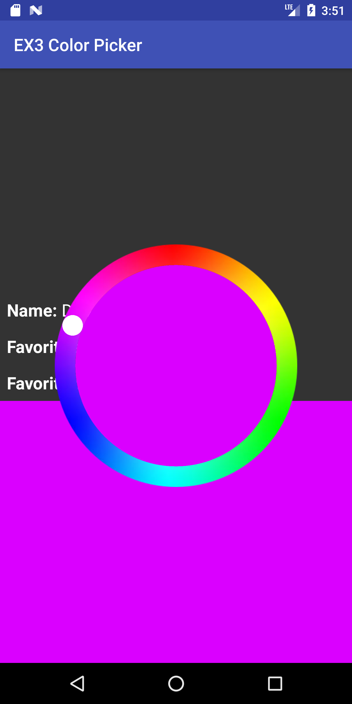

{:toc}

# Goal

Create an RGB color picker which lets you choose a color on a rainbow circle (color wheel).

Tasks:

- Handle different input events in `onTouchEvent`
- Initialize properties during `onLayout` (register the first measure before initializing all views)
- Register callbacks
- Save activity state in bundle
- Restore activity state from bundle

# Getting Started

Over the course of this assignment you will be editing `ColorPickerView.java` and `ColorPickerActivity.java`, it is important to understand the inheritance chains of these two files, as you will be using **lots** of variables and functions defined in parent classes. Read the classes these classes extend!

Consider `ColorPickerView` as a library exposing a component which is being used by the application `ColorPickerActivity`.

It may be wortwhile to read [Android/Custom-Drawing](https://developer.android.com/training/custom-views/custom-drawing) and [Android/UI-Events](https://developer.android.com/guide/topics/ui/ui-events) to understand parts of the assignment that seem tricky.

# ColorPickerView.java

<div class="mermaid">
graph LR
S((.)) --> A((Start))
A -- "Press?insideCircle:updateColor(),setAlpha(.5f)" --> I((Inside))
I -- "Release:setAlpha(1.00f),onColorSelected()" --> E[End]
I -- "Drag?insideCircle:updateColor()" --> I
I -- "Drag?outsideCircle" --> I

classDef finish outline-style:double,fill:#d1e0e0,stroke:#333,stroke-width:2px;
classDef normal fill:#e6f3ff,stroke:#333,stroke-width:2px;
classDef start fill:#d1e0e0,stroke:#333,stroke-width:4px;
classDef invisible fill:#FFFFFF,stroke:#FFFFFF,color:#FFFFFF

class S invisible
class A start
class E finish
class I normal

</div>

## Drawing

To do some parts of your drawing you will need to know the size of the view you are drawing in. Calculate `mRadius`, `mCenterX`, and `mCenterY` of the color picker inside `onLayout`

_Related APIs_:
[View#onLayout](<https://developer.android.com/reference/android/view/View.html#onLayout(boolean,%20int,%20int,%20int,%20int)>)

## Touch Input Events

We'll handle touch input by implementing `onTouchEvent`. This is the event handler that will be called when a touch is registered in this view. First, we need to reject any touches that are outside of the circle. Colors may only be selected by tapping on or inside the color wheel.

<!-- <span style="color:red"> XXX TODO: Check edge case: e.g., drag and move outside wheel, the handle stays in 50% alpha (should be 100% alpha). I added examples in test to check alpha of handle to check state.</span> -->

Then we should update the model based on touch events:

- When a finger touch down, it will show the handle (in 50% alpha).
- When a finger drags on screen inside the circle, the handle will follow the angle the finger is at.
- When a finger drags on screen outside the circle, the handle will stay at the most recent angle within the circle.
- When a finger leaves screen, it will show the handle (in 100% alpha) at the last touch point on the screen.

{:width="150px"}
{:width="150px"}

Use the x and y coordinates of the touch event to calculate the angle (in radians) of the touch on the color circle with `ColorPicker#getTouchAngle(float, float)`.

The angle needs to be mapped to a color on the color wheel. It is difficult to do this mapping in tranditional RGB color space. The HSV color space discussed during class fits this task well. You can read more about the HSV color space [here](https://en.wikipedia.org/wiki/HSL_and_HSV). Since we're just adjusting color, we only want to modify hue while leaving saturation and value constant. You may see detailed instruction in code comments under `ColorPicker#getColorFromAngle`, which we provide you. Use this implementation to guide your work on `ColorPickerView#GetAngleFromColor`, which does the opposite operation.

Finally, you'll need to update the UI to reflect the new selected color. This includes moving the handle to the position on the circle for the selected color and calling `onColorSelected` on any `ColorListeners` with our newly selected color.

_Related APIs_:
[MotionEvent](https://developer.android.com/reference/android/view/MotionEvent) / [Color](https://developer.android.com/reference/android/graphics/Color) / [ColorUtils](https://developer.android.com/reference/android/support/v4/graphics/ColorUtils) / [View#onTouchEvent](<https://developer.android.com/reference/android/view/View.html#onTouchEvent(android.view.MotionEvent)>)

## Callbacks and Listeners

We need to connect the color picker to a view to display our newly chosen color. In `MainActivity`, add a `ColorPicker#ColorListener` to `colorPicker` so that `colorView`'s color and `colorTextView`'s text are changed whenever `onColorSelected` is called.

## The Thumb

In the screenshots there is a visible handle that marks the selected color on the dial. The thumb should move around as a user interacts with the color picker, not just jumping to its final location when they release the finger/mouse.

Visually, the thumb is `0.085` times the outer-radius of the dial (center of circle to outside edge of color). This value is provided to you as a constant. Intuitively, positioning the thumb is similar to `ColorPicker#getTouchAngle(..)` but in reverse, constraining the thumb to stay within the color band.

## Center Circle

Inside the multi-color dial should be a circle that's color is the same as the live selected color. The color of the inner circle, which represents the color picker’s model, should update while you drag the thumb. In contrast, the colored box and text, which represent the application’s model, should update only when the mouse is released.

# ColorPickerActivity.java

## Managing Application State

The application layer of this problem should recieve information about the latest color selected by the color picker only through the listener you create. This means you are **prohibited** from leveraging a publicly accessibly field/function on the color picker to observe its state when necessary.

The application layer should set the default color of `colorPicker` using `ColorPickerActivity#setStartingColor`, we provide this default as `ColorPicker.DEFAULT_VALUE` (it's red). It is also neccessary that `ColorPickerActivity#setStartingColor` triggers `onColorSelected`.

## Save Application Model using Bundle

Please save application model in `onSaveInstanceState` bundle. When user goes off to some other app, Android kills our Activity. We need to get the saved state back.

We want to manage the state at the application level (`MainActivity.java`) versus at the interactor level, this means you will need to find a way to set the state of the color picker from its parent.

Notice from the documentation that `onRestoreInstanceState` is called after `onCreate` if a bundle exists, we want you to handle the bundle in `ColorPickerActivity#setStartingColor` so you should not implement `onRestoreInstanceState`.

<span style="color:red">We will kill the activity to test if the state is saved. Use adb to test killing it or in developer options set Apps -> Don't keep activity.</span>

The best way to test this functionality is to enable the setting referenced above, and then press home, and return to the app. The selected color should still be the same. Quitting the app from multitasking will destroy the bundle.

_Related APIs_:
[Saving and Restoring State](https://developer.android.com/guide/components/activities/activity-lifecycle.html#saras)

# Misc.

This assignment does require doing some math, you are welcome to use the Java Math functions.
_Related APIs_:
[Java Math.\*](https://docs.oracle.com/javase/7/docs/api/java/lang/Math.html)

# Turn-in

## Submission Instructions

You will turn in the following files <a href="javascript:alert('Turn-in link pending assignment release');">here</a>:

```
─ ColorPickerView.java
- ColorPickerActivity.java
```

## Grading (10pts)

- Event Handling (onTouchEvent, etc)
  - Interaction functionality is correct: 1pts
  - Implement PPS properly: 2pt
  - Reject press events that occur outside the wheel: 1pt
- Feedback (onDraw)
  - Place thumb in correct location: 1pt
  - Correctly trigger redraw: 1pt
- Model Management
  - Correctly update ColorView model 1pt
  - Correctly update application model 1pt
- Application Resiliency
  - Save Application State using bundler: 1pt
- Communicate to application properly
  - Implement custom handler for onColorChanged callback 1 pt
- Code Organization and Style: 1 pt

## IDE Errors/Warnings you can ignore

<span style="color:red;">**NOTE:**</span> An error/warning that can be ignored for this assignment **cannot** be ignored for every assignment. Check IDE notices against specs on per assignment basis.

- `onTouchEvent`
  - Custom view ColorPickerViewSolution overrides onTouchEvent but not performClick
