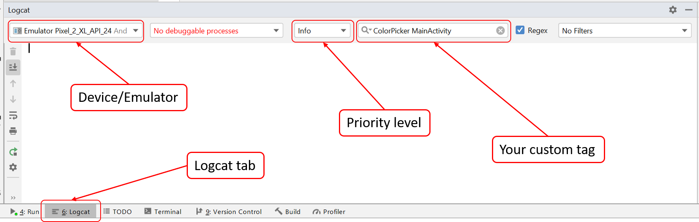

* TOC
{:toc}

# Goal

Create an RGB color picker which lets you choose a color on a rainbow circle (color wheel).

Your primary goal in this assignment is to create
`ColorPickerView.java`. This is your _custom interactor_ and it should
be implemented so it can be used by any application. It inherits from
`ColorPicker.java` and is where you implement the custom interactor.

Tasks for `ColorPickerView`

- Handle different input events in `onTouchEvent`
- Initialize properties during `onLayout` (register the first measure
  before initializing all views)
- Draw the colorpicker in `onDraw`
- Save view state locally

You will also edit `MainActivity.java`. This is your
_application_ and it will _use_ your color picker. `MainActivity`
inherits from `PickerActivity.java` and is where you implement the application
code that uses the custom interactor.

Tasks for `MainActivity`

- Register callbacks
- Save application state in bundle
- Restore activity state from bundle

You will be turning in  `ColorPickerView.java` and `MainActivity.java` so make sure that any variables/fields you create/modify are in these files. 

<span style="color:red">We will be asking you to re-use your color picker interactor in a later assignment so make sure you understand
how the custom interactor communicates with the application.</span>

# Getting Started

Over the course of this assignment you will be editing `ColorPickerView.java` and `MainActivity.java`, it is important to understand the inheritance chains of these two files, as you will be using **lots** of variables and functions defined in parent classes. **Read the classes these classes extend!** Where applicable, you **must** use inherited variables and functions (e.g. don't overload the inherited functions).

It may be wortwhile to read
[Android/Custom-Drawing](https://developer.android.com/training/custom-views/custom-drawing)
and
[Android/UI-Events](https://developer.android.com/guide/topics/ui/ui-events)
to understand parts of the assignment that seem tricky.

# Part 1: Creating your interactor

Your colorpicker view will require you to support drawing (of feedback on the screen) and input handling.

## Drawing

Drawing is implemented in `ColorPickerView#onDraw`. You will need to draw the thumb and the color in the center of the circle. This can be done using things you learned in Doodle, since `ColorPickerView` inherits from `ImageView`. We provide a color dial in the drawable folder and it is already being drawn by `ColorPicker#onDraw` which is called because `ColorPickerView` inherits from `ColorPicker`.

The term `wheel` used throughout the spec refers to the dial **and** inner circle; it is the larger circle that contains all interface you will be drawing.

The height of the dial is the height of `ColorPickerView`, this is not true for the width.

{:width="150px"}
{:width="150px"}

### Key Variables

To do some parts of your drawing you will need to know the size of the view you are drawing in. Calculate `mRadius`, `mCenterX`, and `mCenterY` of the color picker inside `onLayout`. 

_Related APIs_:
[View#onLayout](<https://developer.android.com/reference/android/view/View.html#onLayout(boolean,%20int,%20int,%20int,%20int)>)

### Thumb

In the screenshots there is a visible thumb that marks the selected color on the dial. The thumb is drawn in `ColorPickerView#onDraw` and should move around as a user interacts with the color picker.

The thumb should be constrained to moving along a circular track that places it within the dial. It should move along that track even when the user is dragging their finger inside the inner circle.

Visually, the thumb's radius is `0.085` times the outer-radius of the dial (center of circle to outside edge of color). This value is provided to you as a constant. Intuitively, positioning the thumb is similar to `ColorPicker#getTouchAngle` but in reverse, additionally constraining the thumb to stay within the color band.

To calculate the alpha (which is an `int` [0, 255]) multiply the floats provided in the PPS by 255, then cast to `int`.

### Center Circle

Inside the multi-color dial should be a circle that's color is the same as the live selected color. It should be centered on the center of the wheel, and use up all available space up to the dial. The color of the inner circle, which represents the color picker’s model, should update while you drag the thumb. In contrast, the colored box and text, which represent the application’s model, should update only when the mouse is released.

## Touch Input Events

<div class="mermaid">
graph LR
S((.)) --> A((Start))
A -- "Press?insideWheel:updateColor();updateThumb();setAlpha(.5f)" --> I((Inside))
I -- "Release:setAlpha(1.00f),onColorSelected()" --> E[End]
I -- "Drag?insideWheel:updateColor();updateThumb()" --> I
I -- "Drag?outsideWheel:doNothing()" --> I

classDef finish outline-style:double,fill:#d1e0e0,stroke:#333,stroke-width:2px;
classDef normal fill:#e6f3ff,stroke:#333,stroke-width:2px;
classDef start fill:#d1e0e0,stroke:#333,stroke-width:4px;
classDef invisible fill:#FFFFFF,stroke:#FFFFFF,color:#FFFFFF

class S invisible
class A start
class E finish
class I normal

</div>

Note that the End state only exists to show the lifetime of a _single_ interaction. Because the user can interact with the color picker any number of times, we would actually return to the Start state when the thumb is released. For some examples of single interactions, see the diagrams below.

We'll handle touch input by implementing `ColorPickerView#onTouchEvent`. This is the event handler that will be called when a touch occurs in this view. In addition, when feedback is needed, you will have to ensure that the view is _redrawn_. For style purposes, you should only call `invalidate()` when necessary. `invalidate()` doesn't directly trigger more redraws and will likely have no impact, but it is good style to only call it when needed. We **will be taking off points** for redraw calls if they are not necessary. In this assignment, a good guideline is to do all the redrawing in your PPS code and to only call `invalidate()` once in `ColorPickerView#onTouchEvent`.

As you write the PPS, make sure to utilize proper coding style to ensure that the code is readable to someone not familiar with the project. For an example of how to translate PPS into code, see the [PPS page](./pps.md).

_Related APIs_
[View](https://developer.android.com/reference/android/view/View) (see documentation on Drawing)


### Transitioning out of the Start State

As shown in the state diagram, when in the start state (before interaction begins), we ignore any touches that are outside of the wheel. These events should be _rejected_ by your ColorPickerView so that other interactors can use them if they want. Specifically, views that may lie underneath our `ColorPickerView` should be able to react to events outside the wheel, but within the square of the `ColorPickerView`. Only transition out of the start state when the user presses on or inside the wheel. When you transition out of the start state, color is updated, thumb transparency is changed (to `0.5f`), and thumb position is updated.

The starter code already has some built-in functionality to help you test whether or not you are correctly rejecting input. When you click outside the wheel, there should be a message that pops up saying "You have clicked outside the wheel!". If this message does not appear when you click outside the wheel, then you are not correctly rejecting input.

### Transitions within the Inside State

Once interaction with the wheel begins, we should update the ColorPickerView's local model only when the user is dragging their finger inside the wheel.

- When a finger drags on screen inside the wheel, the thumb will follow the angle the finger is at, and the color of the center circle will update to reflect the change in the local model for the ColorPicker
- When a finger drags on screen outside the wheel, the thumb will stay at the most recent angle within the wheel. If the finger re-enters the wheel at a different angle, the thumb should jump to that angle and the color within the wheel should display the corresponding color.

Use the `x` and `y` coordinates of the touch event to calculate the angle (in radians) of the touch on the wheel with `ColorPicker#getTouchAngle`. It is difficult to do this mapping in tranditional RGB color space. The HSV color space discussed during class fits this task well. You can read more about the HSV color space [here](https://en.wikipedia.org/wiki/HSL_and_HSV). Since we're just adjusting color, we only want to modify hue while leaving saturation and value constant. You may see detailed instruction in code comments under `ColorPicker#getColorFromAngle`, which we provide you. Use this implementation to guide your work on `ColorPickerView#getAngleFromColor`, which does the opposite operation. 

Here are some test values to help test your implementation of `ColorPickerView#getAngleFromColor`:
- angle: 2.5769272, color: -16774401 (blue)
- angle: -1.5461564, color: -64000 (red)
- angle: 0.42093232, color: -15073536 (green)

### Transition to the end state.

When the user finishes interacting with the wheel, you'll need to update the UI to reflect the new selected color, by calling `onColorSelected` on the `ColorChangeListener` with our newly selected color. In addition, the thumb transparency should be reset to `1f`.

_Related APIs_:
[MotionEvent](https://developer.android.com/reference/android/view/MotionEvent) / [Color](https://developer.android.com/reference/android/graphics/Color) / [ColorUtils](https://developer.android.com/reference/android/support/v4/graphics/ColorUtils) / [View#onTouchEvent](<https://developer.android.com/reference/android/view/View.html#onTouchEvent(android.view.MotionEvent)>)

# Part 2: Creating your application

Your application is making use of your color picker. The application needs a way to find out from its fancy new view (`ColorPickerView`) when the color changes. In our case, it will use this information to display the newly chosen color and update the application model, though another application might do something different. Examples of other applications include Photoshop, MS Paint, etc. 

## Setting up the Application

The application layer should set the default color of `colorPicker` using `MainActivity#setStartingColor`, we provide this default as `ColorPicker.DEFAULT_VALUE` (it's red). It is also neccessary that `MainActivity#setStartingColor` triggers `onColorSelected`.

## Managing Application State with Listeners

To find out about color changes, the application needs to register a callback by calling `colorPicker.addColorListener`. This callback
should update the application's `colorView` and `colorTextView` whenever `onColorSelected` is called to demonstrate that the
application correctly got a color from `colorPickerView`. This means you are **prohibited** from leveraging publicly accessible
fields/functions on the color picker to observe the ColorPickerView state. 

As good practice, you should always unregister listeners when they are no longer relevent. This has been done for you in the `MainActivity.java#onDestroy` which is called when the application is killed.

You may notice that `ColorPicker.java` keeps a `List` of `ColorChangeListeners`. This allows for our interactor to be more flexible because it can register many listeners that will all be notfied when a new color is selected. For more on custom listeners, see [CodePath's guide to creating custom listeners](https://guides.codepath.com/android/Creating-Custom-Listeners). For more information about Fragments, see the [Android Fragment API](https://developer.android.com/guide/components/fragments).

# Part 3: Save and Restore Application Model using Bundle

Please save application model (i.e. the current color as known by the application) in the `onSaveInstanceState` bundle. When user goes off to some other app, Android kills our Activity. We need the bundle to get the saved state back.

We want to manage the state at the application level (`MainActivity.java`) versus at the interactor level, this means you will need to find a way to set the state of the color picker from the application when the bundle is loaded.

Notice from the documentation that `onRestoreInstanceState` is called after `onCreate` if a bundle exists. This is where you will access the information we saved in `onSaveInstanceState` to restore the current color with the color we had before our Activity was killed.

<span style="color:red">We will kill the activity to test if the state
is saved. Use adb to test killing it or in developer options set Apps
-> Don't keep activity.</span>

The best way to test this functionality is to enable the setting referenced above, and then press home, and return to the app. The selected color should still be the same. Quitting the app from multitasking will destroy the bundle.

_Related APIs_:
[Saving and Restoring State](https://developer.android.com/guide/components/activities/activity-lifecycle.html#saras)
| [Android Developer Options](https://developer.android.com/studio/debug/dev-options) | [Explanations for how to use Bundle](https://stackoverflow.com/questions/6525698/how-to-use-onsavedinstancestate-example-please)

# Debugging tips and tricks

Logging output is especially useful for testing the functionality of sections of code such as `getAngleFromColor` and other methods. Much like `System.out.print` in Java, Andriod provides its own class for producing output: `Log`. We suggest that you use `Log.i` and create your own custom tag so that you can filter the output for the information you want. Below is an example of how to use the `Log.i` function.

```java
private static final String TAG = "ColorPicker MainActivity";

Log.i(TAG, "Hello world!");
```

To make full use of Logcat, make sure to configure the priority level (in this case, "Info") and use the correct tag (in this case, "ColorPicker MainActivity"). It's also good to check that you have the correct device/emulator selected.

{:width="150px"}

_Related APIs_:
[Android Log.\*](https://developer.android.com/reference/android/util/Log.html) | [Using Logcat](https://developer.android.com/studio/debug/am-logcat)

# Misc.

This assignment does require doing some math, you are welcome to use the Java Math functions.
_Related APIs_:
[Java Math.\*](https://docs.oracle.com/javase/7/docs/api/java/lang/Math.html)

# Turn-in

## Submission Instructions

You will turn in the following files [here](https://gradeit.cs.washington.edu/uwcse/turnin/code/turnin_page_view.php?course=340&quarter=19sp&assignment=ex3):

```
 - ColorPickerView.java
 - MainActivity.java
```

## Grading (10pts)

- Event Handling (onTouchEvent, etc)
  - Interaction functionality is correct: 1pts
  - Implement PPS properly: 1pt
  - Reject press events that occur outside the wheel: 1pt
- Feedback (onDraw)
  - Place thumb in correct location: 1pt
  - Correctly trigger redraw: 1pt
- Model Management
  - Correctly update ColorView model 1pt
  - Correctly update application model 1pt
- Application Resiliency
  - Save Application State using bundler: 1pt
- Communicate to application properly
  - Implement custom handler for onColorSelected callback 1 pt
- Code Organization and Style: 1 pt

## IDE Errors/Warnings you can ignore

<span style="color:red;">**NOTE:**</span> An error/warning that can be ignored for this assignment **cannot** be ignored for every assignment. Check IDE notices against specs on per assignment basis.

- `onTouchEvent`
  - Custom view ColorPickerViewSolution overrides onTouchEvent but not performClick
- Anonymous Class Replaced with Lambda
  - "anonymous new `ColorPicker.ColorListener()` can be replaced with lambda"
