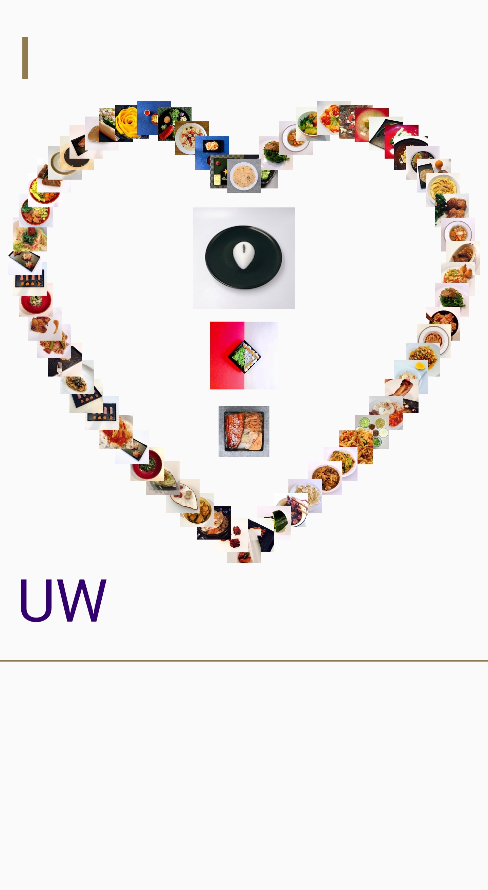
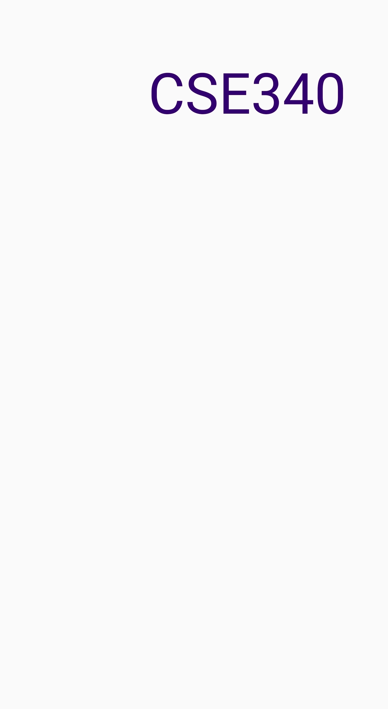
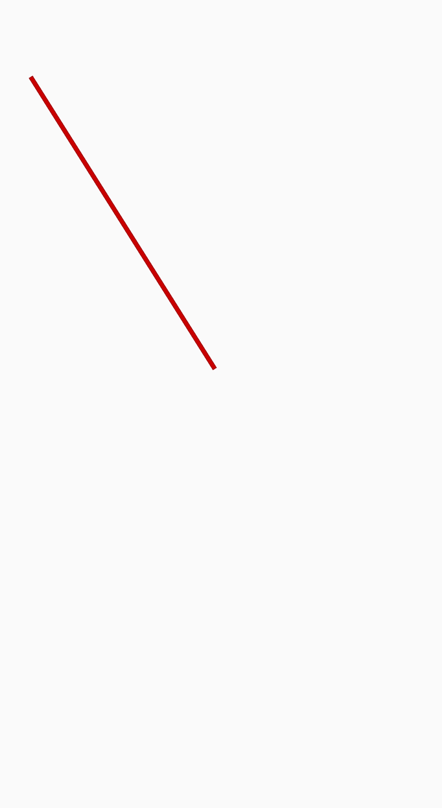
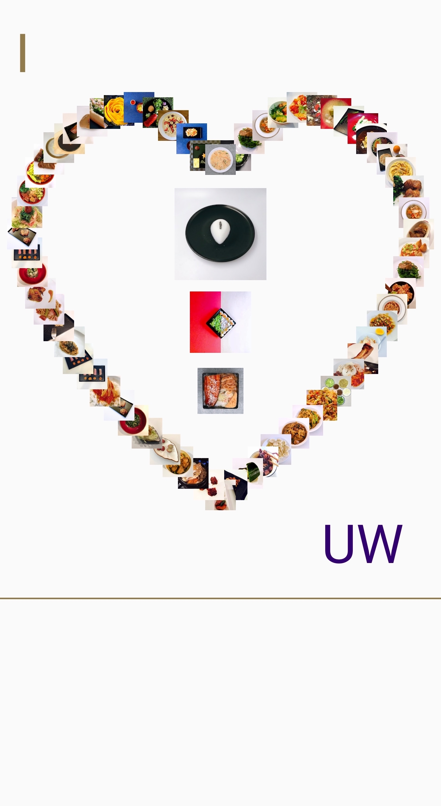

* TOC
{:toc}

# Assignment Description

For this assignment, you will be creating an activity class which will allow you to create "Doodles" consisting of images, lines, and text.

This assignment will take about 6 - 8 hours to complete. You should expect this amount of workload on most assignments this quarter, so make sure to build good habits when completing it.

If you find yourself taking additional time on this submission, we strongly suggest that you get in touch with the course staff on Piazza or in person.

## Learning Goals

- Use abstracted methods to draw onto the screen.
- Create animations in Android Studio.
- Begin considering how to style your Android apps.

# Part 1
***

Tasks:
- Download and install Android development environment
- Open our skeleton code in Android Studio
- Implement three methods: `addImage`, `addText`, `addLine`
- Call the methods you implemented and compare your app screen with our screenshot
- Animate `UW` so it slides from left to right when the app opens.

This task involves implementing three methods in `Part1.java`. Each method is named here but detailed doc comments can be found in `Part1`'s superclass, `Doodler`, which also defines some nice helper methods. It also defines the `onCreate` behavior of the Activity which calls the method `Doodler#doodle(FrameLayout)`.

In `Part1`, you'll find missing implementations for three methods: `addImage`, `addText`, and `addLine`.

Subclasses of `Part1` will have access to these methods once they are implemented. Take a look at an example of this in `Part1Activity`. It extends `Part1` and uses the three methods to draw the following image on the screen:

{:width="25%"}

You'll notice in `doodle` in `Part1` that we use `scaleX` and `scaleY` around our coordinates (and size for images). These allow us to ensure the doodle still looks good on smaller screen sizes. **If you use _any_ pixel coordinates in your solutions, remember to wrap them in these scaling methods**. These will scale coordinates from the Pixel 2 XL to the dimensions of your device's screen. We'd recommend that you use a Pixel 2 XL emulator to compare the finished doodle against our screenshot to be sure you're implementing everything right.

Additionally, there are instances where the the image CSV file fails to load properly due to discrepencies in line endings (CRLF vs LF). If you run into this,
try redownloading the file or re-saving it in a text editor.

### Specs for addImage
```java
ImageView addImage(FrameLayout mainCanvas, String imageName, float x, float y, int size);
```

Most of this method is implemented for you. Please read through it to understand how it works, then try to set the size and location of ImageView added in this method. You can find the solution implementation of this method [here](/interaction/slides/l01/doodle.html).

*Related APIs*:
[ImageView](https://developer.android.com/reference/android/widget/ImageView.html)

### Specs for addText
```java
TextView addText(FrameLayout mainCanvas, String text, float x, float y, int fontSize, int color);
```

*Related APIs*:
[TextView](https://developer.android.com/reference/android/widget/TextView.html) /
[TextView#setTextColor](https://developer.android.com/reference/android/widget/TextView#setTextColor(int))

You may find the comments and the implementation of `addImage` useful.

If you implement it correctly, you'll see the image below if you run:
```java
addText(mainCanvas, "CSE340", scaleX(550), scaleY(200), 60, Color.rgb(51,0,111))
```

{:width="25%"}

### Specs for addLine
```java
ImageView addLine(FrameLayout mainCanvas, float startX, float startY, float endX, float endY, int width, int color);
```

There are several ways to draw a line. [android--code](https://android--code.blogspot.com) has [a good example](https://android--code.blogspot.com/2015/11/android-how-to-draw-line-on-canvas.html).

For your `Bitmap`, you can use `Bitmap#createBitmap(int, int, Bitmap.Config)` to create a new `Bitmap` with the width and height of the current screen. **You can find the width and height of the current device screen in the `PHONE_DIMS` constant of `Doodler`**. It will be available to you in `Part1`.

**You may notice that the line does not fully span the width of the screen.** This is due to the `ImageView` in which the `Bitmap` resides having a margin around it. To fix this, **set the width and height of the `ImageView` to match the dimensions you set for the `Bitmap`**. See `addImage` for how to adjust the width and height of an `ImageView`.

If you implement it correctly, you'll see the image below if you run:
```java
addLine(mainCanvas, scaleX(100), scaleY(250), scaleX(700), scaleY(1200), 15, Color.rgb(200,0,0))
```

{:width="25%"}

### Animating Text

Once you've animated the three methods defined above, your doodle should match. For the last part, you will need to figure out how to animate text. In `Part1#doodler(FrameLayout)`, use animations to move the `TextView` uw from `(50f, 1650f)` to `(1050f, 1650f)`. Remember to apply `scaleX` and `scaleY` to these animations.

*Related APIs*:
[ObjectAnimator](https://developer.android.com/reference/android/animation/ObjectAnimator)

Once you've finished your animation, your doodle should match this screenshot:
{:width="25%"}

# Part 2
***

Tasks:
- Create a beautiful doodle of your own

This is where your creativity comes into play. We've created a blank slate for you in `Part2Activity`. In here you should use all three methods implemented in [Part 1](#part-1) to draw your own doodle. You are welcome to implement new methods in `Part2Activity` to make a more creative and beautiful doodle.

**Tips**:
- To control which activity launches with the app by moving the existing `<intent-filter>` tag between different activities.
- Aim for complexity similar to [Part 1](#part-1) (images, text, and shapes) though you don't need to use as many images. Try to be creative, you work will be graded by your peers. 
- You may use the attractive home-cooked food images ([photo credit](https://www.XiaoyiZhang.me)) we include in `res/drawable` or use your own images.
  - **If you chose to use your own images, please be sure to turn them in exactly as specified in [Turn-in](#turn-in).**
- If your animation is laggy, please reduce the number of images you put on canvas or reduce the file size of images (e.g., convert png to jpg, reduce resolution of image file).
- **Make sure that your doodle depends on _nothing_ outside of the files described in [Turn-in](#turn-in).**

*For Peer Grading*
<!-- XXX TODO(rfrowe): Will we use canvas -->
This portion of the assignment will be peer graded. You will receive 1pt for peer grading others' doodles. You will have a chance to nominate the most creative doodles. The winners will be shown off in class.

*Related APIs*:
[Android Animation](https://developer.android.com/training/animation/reposition-view) /
[View Animation](https://developer.android.com/guide/topics/graphics/view-animation.html) /
[Property Animation](https://developer.android.com/guide/topics/graphics/prop-animation.html) /
[Vogella Tutorials - Android Animation](http://www.vogella.com/tutorials/AndroidAnimation/article.html)

# Turn-in
## Submission Instructions

You will turn in the following files [here](https://gradeit.cs.washington.edu/uwcse/turnin/code/turnin_page_view.php?course=340&quarter=19sp&assignment=ex1):

```
─ Part1.java
─ Part1Activity.java
─ Part2Activity.java
- images.zip (optional)
  ├── abc.png
  ├── ...
  └── xyz.jpg
- part2.csv (optional)
```

If you use your own images in [Part 2](#part-2), please include them in a ZIP archive. The images should be compressed together without an enclosing folder. Ex: `zip images.zip abc.jpg ... xyz.jpg`. Do not place the files in a folder called `images` and compress that.

If you're positioning a large number of images for [Part 2](#part-2), it may be best to use a CSV similar to `data.csv` which is used for the heart in [Part 1](#part-1). Include this as `part2.csv` if necessary. Remember, the CSV coordinates are on a Pixel 2 XL and scaled to the current screen in `Doodler#addAllImagesFromData(FrameLayout)`.

## Reflection
In addition, you are expected to turn in a short reflection on this assignment. Moving forward for this quarter, you will be expected to fill out a reflection for each assignment. These reflections are your opportunity to offer us feedback on the structure of each assignment, as well as reflect on the topics covered.

These reflections should always be submitted directly to Gradescope. 

For this assignment, your reflection should at minimum cover the following:

- *Why might it be better to animate a view, rather than invalidate/redraw its contents?*

- *At the moment our application is pretty static. Think of at least two ways that you would go about adding interactivity to this application.*

## Grading (10pts)

- Part 1
  - `addImage`: 1 pt
  - `addText`: 1 pt
  - `addLine`: 3 pts
  - `UW` Animation: 1 pt
- Part 2
  - Peer Grading of Custom Doodle
    - Using each of the three methods: 1 pt
    - Using an animation: 1 pt
  - Complete assigned peer grading: 1 pt
- Turn-in and compiles: 1 pt

