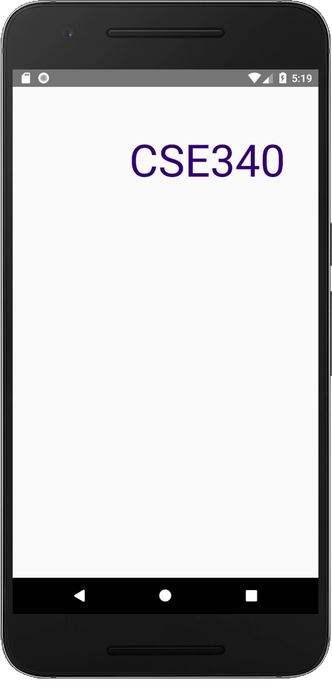
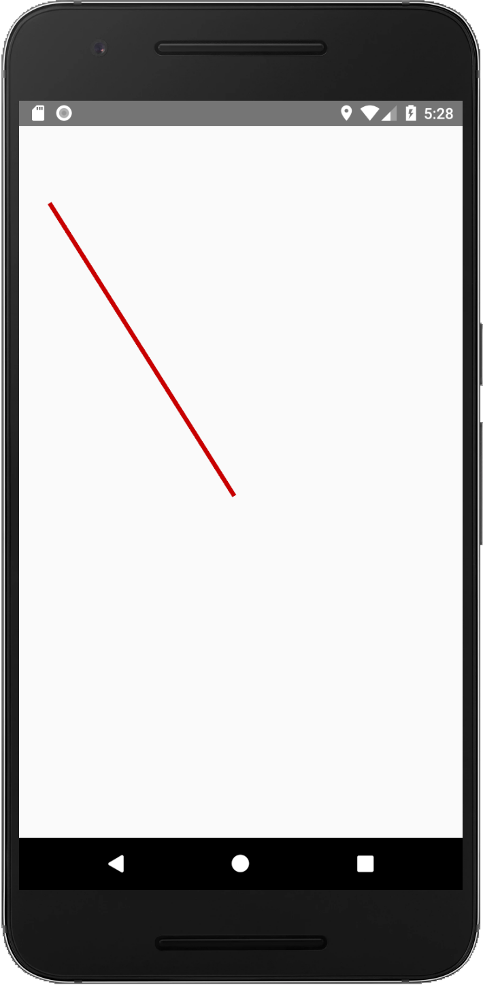

* TOC
{:toc}

# Doodle Exercise

**Objective**: Create an Android app that draws a doodle consisting of a text, a line, and a set of images on the main canvas.

**HCI Goals**:
- Use abstractions to draw on screen
- Create animations
- Use coordinate transformation
- Try to create something appealing

**Android Goals**:
- Get familiar with Android Studio
- Understand XML and View
- Load image and drawable resources
- Learn Activity Lifecycle

**Assigned Date**: ???, 2019

**Due Date**: ???, 2019

# Part 1

Tasks:
- Import our code skeleton to Android Studio
- **Implement 3 functions** (addImage, addText, addLine)
- Call the functions you implemented and compare your app screen with our screenshot
- Read through this [basic animation](https://developer.android.com/training/animation/reposition-view) tutorial
- Animate `UW` so it slides from left to right when the app opens.

### Specs for addImage
```java
Function addImage(FrameLayout mainCanvas, String imageName, Float x, Float y, int size)
```

Most of this method is already implemented for you. Please read through it to understand how it works.

Please set the size and location of image in this method.

### Specs for addText
```java
Function addText(FrameLayout mainCanvas, String text, Float x, Float y, int fontSize, int color)
```
Please implement addText function so that you can add text on canvas.

*Related APIs*:
[TextView](https://developer.android.com/reference/android/widget/TextView.html) /
[TextView#setTextColor](https://developer.android.com/reference/android/widget/TextView#setTextColor(int))

You may find the comments and the implementation of addImage useful.

If you implement it correctly, you'll see the image below if you run:
```java
addText(mainCanvas, "CSE340", 550f, 200f, 60, Color.rgb(51,0,111))
```

{:width="150px"}


### Specs for addLine
```java
Function addLine(FrameLayout mainCanvas, Float startX, Float startY, Float endX, Float endY, int width, int color)
```

There are several ways to draw a line. [android--code](https://android--code.blogspot.com) has [a good example](https://android--code.blogspot.com/2015/11/android-how-to-draw-line-on-canvas.html)

If you implement it correctly, you'll see the image below if you run:
```java
addLine(mainCanvas, 100f, 250f, 700f, 1200f, 15, Color.rgb(200,0,0))
```

{:width="150px"}


### Animating Text

You will need to first figure out how to animate the TextView created by `addText` then decide where in the Activity lifecycle the animation should be placed so it is triggered when the app opens.

The `UW` text should translate horizontally from `(50f, 1650f)` to `(1000f, 1650f)`. Animation duration should be less than 2 seconds.

*Related APIs*:
[ObjectAnimator](https://developer.android.com/reference/android/animation/ObjectAnimator)

{:width="150px"}

# Part 2

Tasks:
- Create a beautiful doodle of your own

You should use all 3 functions implemented in [Part 1](#part-1). You are welcome to implement new functions to make a creative and/or beautiful doodle. Aim for complexity similar to part 1 (images, text, and shapes) though you don't need to use as many images. Try to be creative, you work will be graded by your peers.

Your may use the attractive home-cooked food images ([photo credit](https://www.XiaoyiZhang.me)) we include in `res/drawable` or use your own images.

*Related APIs*:

[Android Animation](https://developer.android.com/training/animation/reposition-view) / [View Animation](https://developer.android.com/guide/topics/graphics/view-animation.html) / [Property Animation](https://developer.android.com/guide/topics/graphics/prop-animation.html) / [Vogella Tutorials - Android Animation](http://www.vogella.com/tutorials/AndroidAnimation/article.html)

If your animation is laggy, please reduce the number of images you put on canvas or reduce the file size of images (e.g., convert png to jpg, reduce resolution of image file).

*For Peer Grading*
You will receive 1 pt for peer grading others' doodles.
Grading standard (2 pts in total): 1 pt for using functions, 1 pt for using animation.
You will have a chance to nominate most creative doodles, and we will show them in class.


# Turnin
## Submission Instructions

Please turn in your files in the following zip structure:

```bash
YOUR_STUDENT_ID.zip
├── Part1Activity.java
├── Part2Activity.java
├── images (optional)
│   ├── abc.jpg
│   ├── ...
│   └── xyz.jpg
└── part2.csv (optional)
```

If you use your own images in [Part 2](#part-2), please include them in images folder.

If you're positioning a large number of images for part 2, it may be best to use a CSV similar to `data.csv` which is used for the heart in [Part 1](#part-1). Include this as `part2.csv`.

## Grading (10pts)

- Part 1
  - `addImage`: 1 pt
  - `addText`: 1 pt
  - `addLine`: 3 pts
  - `UW` Animation: 1 pt
- Part 2
  - Custom doodle (peer grading score): 2 pts
  - Do peer grading on others' doodles: 1 pt
- Turn-in and compiles: 1pt
