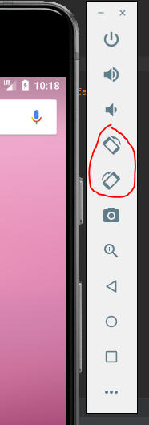

* TOC
{:toc}

This is the assignment spec for Exercise 2. Scroll down below part 5 for some development strategies and tips curated from last spring's students!

# Part 1

---

`part1.xml` can be found in the `res/layout` directory in Android Studio once the `layout` project has been opened.

Tasks:

- Reproduce a given interactor hierarchy and diagram using the Android Studio visual editor.

<!--
This is something that we have to figure out -- are we going to reuse the old part 1, or rewrite it from scratch to suit the new assignment?
-->

# Part 2

---

The `Part2View` starter code can be found in the `cse340.layout` directory in Android Studio.

Tasks:

- Working with View object in Java to reproduce the composed layout from the visual editor.

In `Part2Activity` we have set up the basic scaffolding necessary to complete the given layout. For this section you will be instantiating the view objects from Part 1 programmatically.

Before getting started on this section, try constructing a [LayoutInflater](https://developer.android.com/reference/android/view/LayoutInflater.html) and passing in your `part1.xml` file.

*Hint: Look for a method which accepts our current context as a parameter and returns a new LayoutInflater.*

The LayoutInflater allows us to accept a valid XML file, in this case our `part1.xml` file, and convert it into a customizable View object. The XML/visual editor makes it much easier to build our app layouts, so we can use that to create new layouts, then use an inflater to convert the XML into an object before programmatically appending it to our current app layout.

For this part, you cannot use the LayoutInflater in your final submission. However, you are encouraged to familiarize yourself with the inflator in order to better understand how it works (this will be useful on the upcoming parts!).

# Part 3

---

The `Part3View` starter code can be found in the `cse340.layout` directory in Android Studio.

Tasks:

- Utilizing a combination of programmatic and pre-written layouts to produce a working model based on a provided spec sheet.

- Using Java to write code which evenly distributes ImageViews between a given set of columns.

For this part, you will be recreating a Pinterest-like layout. A diagram has been provided below.

On the left: the old design. On the right, the new design. How about that?

Pinterest is a great example of a high-profile app that can be built with relatively simple layout instructions. For instance, one could imagine breaking the layout into two large vertical columns, then assigning various elements to each one.

For this part, you will be doing just that. Using a combination of programmatic and XML layout, you will build the columnar layout necessary to house the images provided in `res/drawables`. Using Java, you should take into account the height of each image, so that each successive image is added to the shorter column. In order to accomplish this, you should take into account the height of each image resource provided.

*Hint: Our images are all actually the same width. Although we cannot rely on the width and height of the image view before it is added to the view, we can find a way to access the image resource it contains in order to calculate its impact on the column height.*

In `Part4View`, you should accomplish the following:

- Add each image to one of two columns. By using two `LinearLayout`s instead of simply adding all images to the parent `ConstraintLayout` and using constraints to maintain the columns, we reduce the number of constraints required from `O(n)` to `O(1)` for `n` images.
    * Each image should be `vMargin` from the previous image vertically (or the top of the column if first image).

- There should be a vMargin gap between the two columns, however, **the center of the gap must be in the exact center of the screen**.

- The bottom of the last image should be flush with the bottom of the column.

- Finally, you should adjust the scaling of your images so that they scale proportionately to fill their respective columns. This means that you must take the aspect ratio into account, so that as your images expand to fill the column, their height scales up as well, preserving their aspect ratio. Additionally, when rotated, the images should change width (and therefore height) to fit the larger columns.
    * (Hint: there's a function which will will do this for you.)

To determine which column a photo should go in, we will use "pinterest" ordering. You should track the height of the images in each column and add the next image to the shorter column (or the *left* if equal). Be careful not to track the height of the `Drawables` as opposed to the display height of the image. Two photos of the same aspect ratio should affect the column height identically regardless of resolution as they will both have the same size on-screen.

{:width="30%"}
{:width="30%"}

{:width="45%"}
{:width="45%"}

For this part, you may apply the margin rules to your liking in order to achieve the above layout. For instance, in order to satisfy the margin constraint between columns, you may apply a margin rule to each image, or to the columns.

# Part 4

---

The `Part4View` starter code can be found in the `cse340.layout` directory in Android Studio.

For part 4, feel free to explore anything pertaining to layout that we have discussed in the past 2 weeks. You have several options for this submission:

* Wireframe and recreate an interface from another popular app. For instance: Twitter, Facebook, Instagram, etc.
    * If you are worried about the workload, approach any member of the course staff for their suggestion.

* Wireframe and recreate your own interface from scratch! Make use of the views discussed in the previous three parts as well as any others to create your own custom app layout.

Your layout must meet the following requirements:
(guess)
* Implements at least three different view types either in XML or programmatically to accomplish the desired app layout.
    * One of these MUST be a scroll layout, in order to make your custom app scroll!

* Contains at least 5 view nodes. A view node is defined as a View which contains no nested views, for instance an ImageView or TextView.

# Part 5

---

For this part, you simply need to provide a paragraph of reflection on your submission. Some things you may want to cover here:

* Your experience, positive or negative, working on parts 1 - 4. We are always looking to revise these specs as necessary, so any feedback provided here will improve the quality of assignment rubrics for future quarters.

* Anything new that you learned while working on the assignment. This can be anything related to the process of building your app, including:
    * new concepts in Java/Android
    * new strategies for designing wireframes and layouts
    * Advice you received from an instructor or peer which helped you complete the assignment.

* Any feedback you have on the provided rubrics. Was anything unclear? Let us know!

* Anything you want more explanation on in class. Although we can't cover everything, we will take these suggestions into account when planning out future material.

# Development Strategies

---

* You may run into issues when rotating the device. Note that, when rotating the emulated device, or your personal Android device, that the layout should adjust accordingly. You do not need to readjust the layout of your images when rotating the device, as this should remain the same.

These buttons will allow you to rotate the emulated device clockwise/counter-clockwise.

* When dealing with the Android documentation: ask as many questions as necessary! The android documentation can be painful to read through, as there are many potential options to choose from. If you need any help parsing it, feel free to ask anyone on the course staff for advice! Additionally, we suggest that you read through the following resources as you develop your apps, in order to better understand the tools you are utilizing:
    * [Linear Layouts | Android Developers](https://developer.android.com/guide/topics/ui/layout/linear)
    * ["Building a Responsive UI with Constraint Layout" -- Note the "Set Size as a ratio" section here](https://developer.android.com/training/constraint-layout)
    * ["An explanation of the ImageView ScaleType attribute" - Important when developing part 3!](https://thoughtbot.com/blog/android-imageview-scaletype-a-visual-guide)
    * ["What's new in Constraint Layout 1.1.0" - Covers some new features you can utilize when building your layouts in part 4!](https://android.jlelse.eu/whats-new-in-constraint-layout-1-1-0-acfe30cfc7be)
