* TOC
{:toc}

# Part 1

---

`part1.xml` can be found in the `res/layout` directory in Android Studio once the `layout` project has been opened.

Tasks:

- Create `TextView`, `ImageView`, and `Button`
- Constrain them for automatic portrait and landscape layouts

First, create a `Button` in `part1.xml`. It should say `BUTTON` by default. Make sure the background color matches ours, `colorPrimary`. Color abstractions in `values/colors.xml` allow us to avoid changing values in multiple places in the future.

Next, create a `TextView`. Set the background color to black and add a `0` as the text. The font should be white and `200sp`. There also exists a similar `values/strings.xml` which allows us to store strings in a central location. For our purposes, you can hardcode the text into `part1.xml`. You may notice an IDE warning about hardcoded strings, just ignore it.

Finally, create an `ImageView`. It should contain `drawables/food_0` and be `150dp` by `150dp`.

All three views will have at least two sides along the perimeter of the `ConstraintLayout`. These sides should have a margin of `20dp` preventing the views from touching the edge. As the screen rotates/resizes, all views should stay `20dp` from the edge.

The `ImageView` should reside in the top left. As the screen rotates/resizes, it should remain constant in size.

The `Button` should reside in the bottom left. Its width should match the `ImageView` and it should be perfectly aligned with it. As the screen rotates/resizes, it should remain constant in size.

The `TextView` should be `20dp` from the right edge of the `ImageView`. As the screen rotates/resizes, it should change width to maintain the `20dp` margin.

<span style="color:red;">**NOTE:**</span> It is possible to position some of the views in this assignment without constraints due to the fact that unconstrained views float upwards unless prevented by another view or a margin. **The purpose of this assignment is to practice constraints so such solutions will not be accepted. Every view you add during this assignment, including the other parts, will require at least one constraint.**

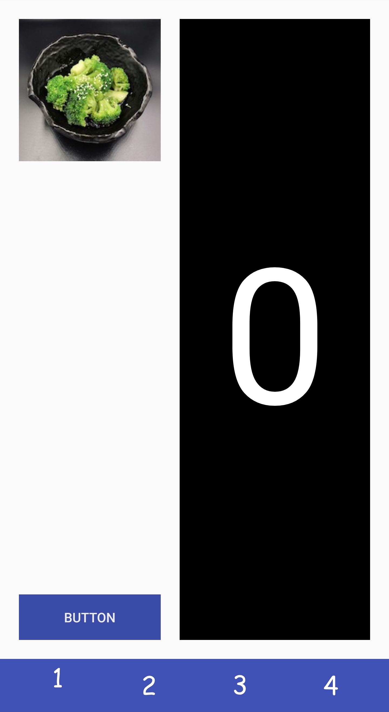{:width="25%"}
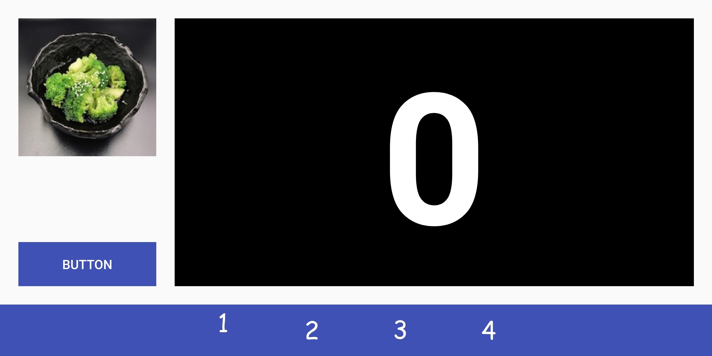{:width="50%"}

# Part 2

---

`part2.xml` can be found in the `res/layout` directory in Android Studio once the `layout` project has been opened.

Tasks:

- Working with a basic `ScrollView`
- Add a fixed number of items with fixed constraints.

In `part2.xml` we've created a basic `ScrollView` for you wrapped around a `ConstraintLayout` which will allow its contents to scroll.
Add ImageViews with drawables `food_0` through `food_3` for a total of four images to the `ConstraintLayout`.
Let each photo display at its natural resolution. As all three photos are exactly `200px` wide, so we can form a perfect column from them.

Using constraints, center them in the parent `ConstraintLayout`. Then position them such that `food_0` is `16dp` from the top of the parent layout and each additional `food_i` is `(16 * i)dp` from `food_(i-1)`.

That is, `food_1` is 16dp below `food_0`, `food_2` is 32dp below `food_1`, and `food_3` is 48dp below `food_2`. This increasing margin layout will also be used in [Part 3](#part-3). There should be **no** margin after the last photo. That is, it should be flush with the tab bar.

When the layout is rotated, the images should stay the same size and remain horizontally centered.

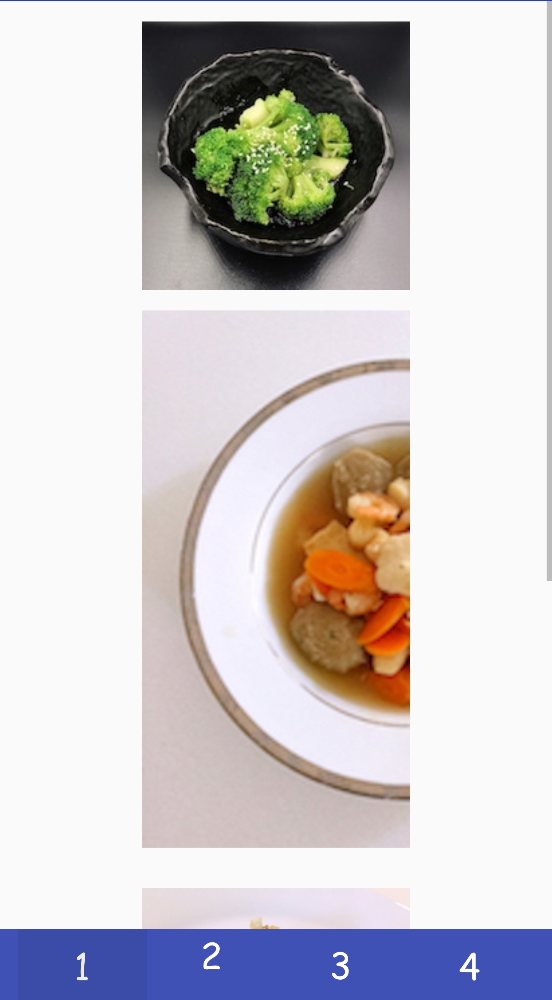{:width="20%"}
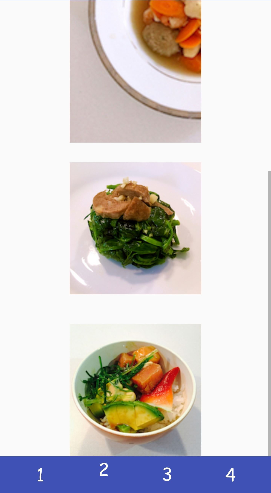{:width="20%"}
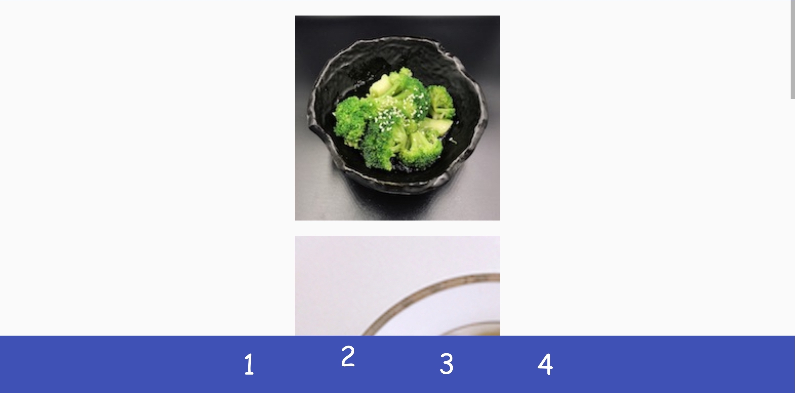{:width="50%"}

# Part 3

---

Tasks:

- Subclass a `ScrollView`
- Add a variable number of items with programmatic constraints.

This time, we'll be adding images and constraints programmatically with similar conditions as [Part 2](#part-2).

First, add a ConstraintLayout then create ImageViews for each image to add to the ScrollView.

Using the similar math as part 2, position the first image `vMargin` px from the top (`vMargin` is a parameter in Part3View constructor), then the top of each image i afterward `vMargin * i` px from the bottom of the previous image. Note here we're working in `px`. At runtime, all `dp` values are represented as `px` which is dependent on the current device resolution. We've done this conversion for you. You can see how we convert `dp` to `px` in `MainActivity#L38`.

Again, when the layout is rotated, the images should stay the same size and remain horizontally centered.

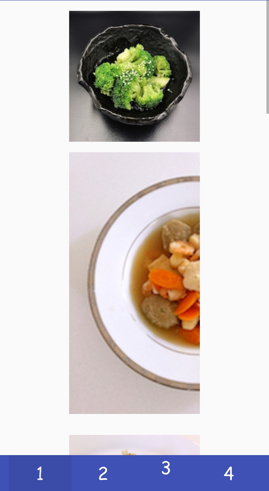{:width="30%"}
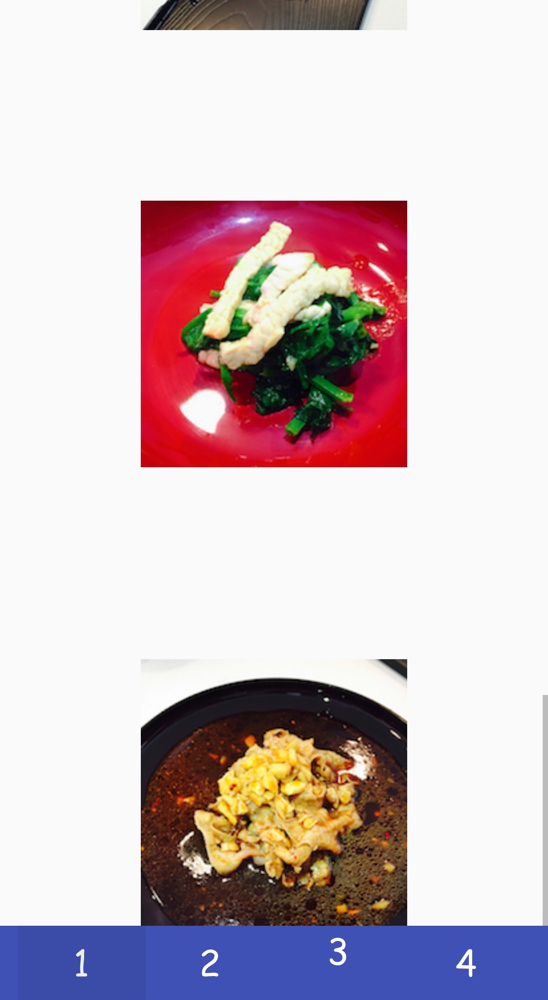{:width="30%"}

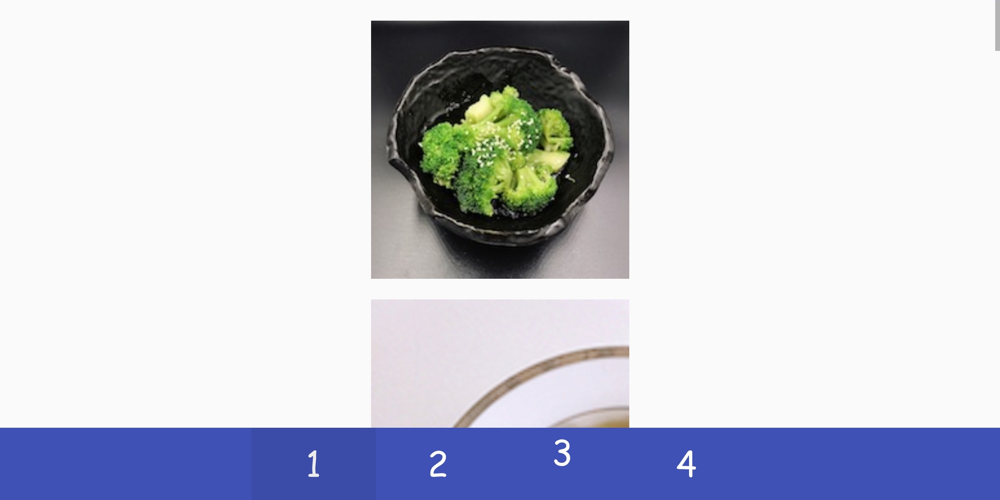{:width="45%"}
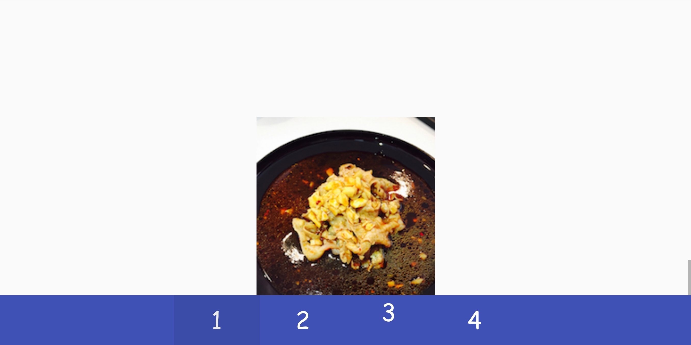{:width="45%"}

# Part 4

---

Tasks:

- Subclass a `ScrollView`
- Add a variable number of items with programmatic constraints.
- Maintain two balanced columns with "pinterest" ordering.

This will be similar to [Part 3](#part-3) but with two columns. Inside `part4_grid.xml`, add two `LinearLayout`s to be our columns. Constrain them such that they equally divide the horizontal space with no padding or margin. When the view is rotated, the columns should change width to maintain the 50% split.

In `Part4View`, add each image to one of the two columns. By using two `LinearLayout`s instead of simply adding all images to the parent `ConstraintLayout` and using constraints to maintain the columns, we reduce the number of constraints required from `O(n)` to `O(1)` for `n` images. Each image should be `vMargin` from the previous image vertically (or the top of the column if first image). There should be a vMargin gap between the two columns, however, **the center of the gap must be in the exact center of the screen**. The bottom of the last image should be flush with the bottom of the column. Finally, each image should expand to fill the width as restricted by the margins described above and the height should be such that the aspect ratio matches the source drawable. (Hint: there's a function which will will do this for you.) When rotated, the images should change width to fit the larger columns.

To determine which column a photo should go in, we will use "pinterest" ordering. You should track the height of the images in each column and add the next image to the shorter column (or the left if equal). Be careful not to track the height of the `Drawables` as opposed to the display height of the image. Two photos of the same aspect ratio should affect the column height identically regardless of resolution as they will both have the same size on-screen.

{:width="30%"}
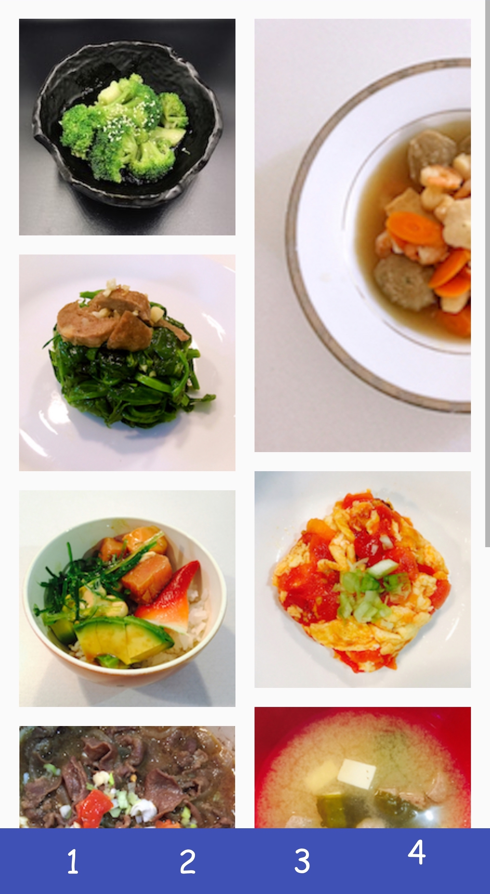{:width="30%"}

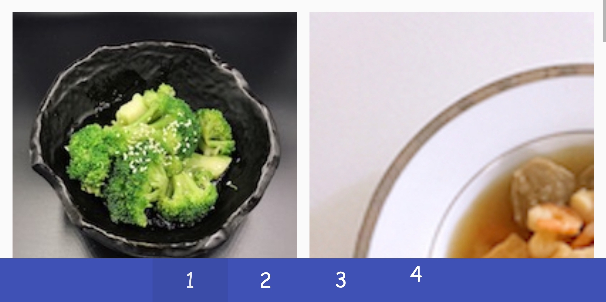{:width="45%"}
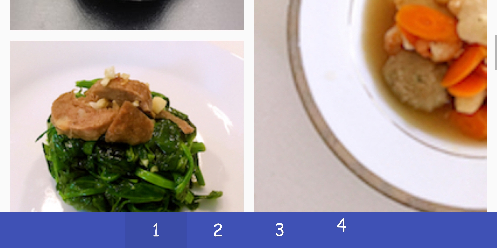{:width="45%"}

# Turn-in

## Submission Instructions

You will turn in the following files [here](https://gradeit.cs.washington.edu/uwcse/turnin/code/turnin_page_view.php?course=340&quarter=19sp&assignment=ex2):

```
─ part1.xml
─ part2.xml
- Part3View.java
- Part4View.java
- part4_grid.xml
- strings.xml
```

<span style="color:red;">We will test layout on emulators with different screen sizes. Please use constraint correctly. Don't just try to match pixels in our sample screenshots.</span>

## Grading (10pts)

- Part 1
  - Portrait: 1 pt
  - Landscape: 1 pt
- Part 2
  - Portrait and Landscape: 1 pt
- Part 3
  - Portrait: 1 pt
  - Landscape: 1 pt
- Part 4
  - Correct “Pinterest” column ordering: 2 pts
  - (Portrait and Landscape) Correct image widths: 1 pt
  - (Portrait and Landscape) Correct image margins: 1 pt
- Code Organization and Style: 1 pt

## IDE Errors/Warnings you can ignore

<span style="color:red;">**NOTE:**</span> An error/warning that can be ignored for this assignment **cannot** be ignored for every assignment. Check IDE notices against specs on per assignment basis.

- `Button`
  - Hardcoded Strings
- `TextView`
  - Hardcoded Strings
- `ImageView`
  - Missing `contentDescription`
