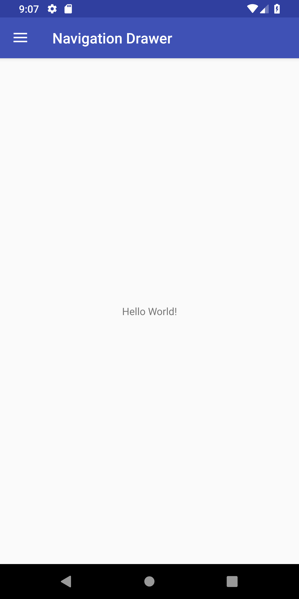
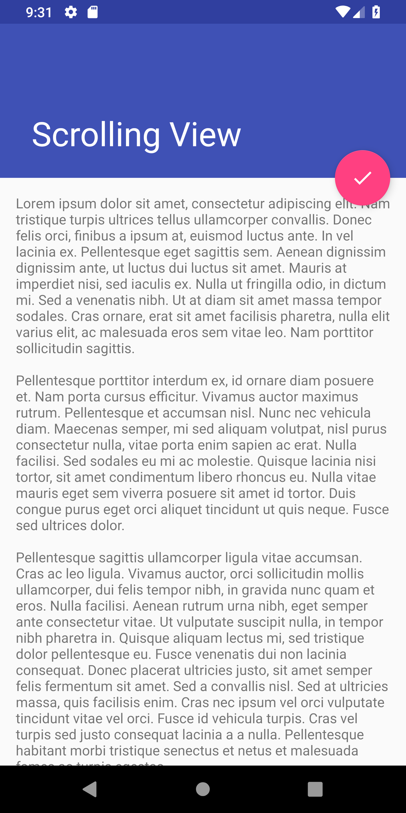
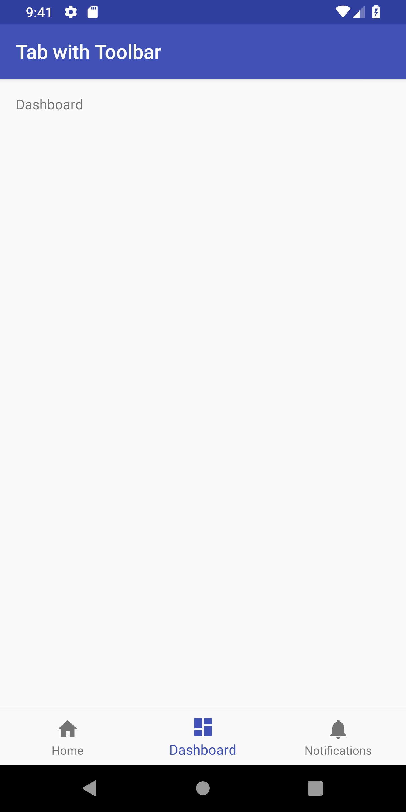

* TOC
{:toc}

# Layout Assignment

**Objective**: Replicate an existing application layout.

**Learning Goals**:
- Activity Lifecycle
- Event callbacks
- Familiarize with different layout types
- Basic constraints

**Assigned Date**: ???, 2019

**Due Date**: ???, 2019

# Part 1

Tasks:
- Implement a navigation drawer activity
- First create base layout
- Then create drawer layout which changes base contextually

Start by creating a base activity with a `Toolbar` and `TextView`. The `TextView` should be centered in the screen and contain some default text. Don't worry, we'll be changing it later. It should match the screenshot below.

*Related APIs*:
[TextView](https://developer.android.com/reference/android/widget/TextView.html)



Next, create the drawer layout. It requires a header and a menu. In the screenshot below, the header consists of a green background, an icon, and "CSE 340". The menu should have "Import", "Gallery", and "Share" options with appropriate icons as well as a separate "Next" option to go to [Part 2](#part-2)'s layout.

In order to activate and deactivate the navigation drawer, we a hamburger button to toggle the drawer's state. Tapping the toggle should open the door and tapping in the shaded region should close it. To handle events in the drawer, you'll want to implement `NavigationView.OnNavigationItemSelectedListener`. When a new option is selected, the `TextView`'s contents should change appropriately to the text of the menu item selected. This text should also be set `onCreate` to "Import" as this should be the default selection in the drawer.

If back is pressed while the drawer is open, it should be closed. If it is pressed while closed, the app should exit.

*Related APIs*:
[NavigationView](https://developer.android.com/reference/android/support/design/widget/NavigationView)
[DrawerLayout](https://developer.android.com/reference/android/support/v4/widget/DrawerLayout)
[ActionBarDrawerToggle](https://developer.android.com/reference/android/support/v4/app/ActionBarDrawerToggle)
[NavigationView.OnNavigationItemSelectedListener](https://developer.android.com/reference/android/support/design/widget/NavigationView.OnNavigationItemSelectedListener)


# Part 2

Tasks:
- Implement a basic scrolling view
- Use a `CollapsingToolbarLayout` to appropriately use screen space while scrolling

This activity should consist of a toolbar and scrolling `TextView` separated by a `FloatingActionButton`. When the button is pressed, the app should launch the activity from [Part 3](#part-3). Fill the `TextView` with some [Lorem Ipsum](https://www.lipsum.com/) filler. As the text is scrolled, the toolbar should collapse and the button should disappear until scrolled back to the top. When back is pressed, the app should return to the activity from [Part 1](#part-1).

*Related APIs*:
[CollapsingToolbarLayout](https://developer.android.com/reference/android/support/design/widget/CollapsingToolbarLayout)
[NestedScrollView](https://developer.android.com/reference/android/support/v4/widget/NestedScrollView)
[FloatingActionButton](https://developer.android.com/reference/android/support/design/widget/FloatingActionButton)




# Part 3

Tasks:
- Create a tabbed layout
- Use constraints to position tab bar
- Contextually change text based on tab selection

Again start with a base layout with a `Toolbar` and `TextView` layout. Create a `BottomNavigationView` and position it with constraints with a menu consisting of "Home", "Dashboard", and "Notifications". When a new tab is selected, the `TextView`'s contents should be updated to the name of the tab. When back is pressed, the app should return to the activity from [Part 2](#part-2).

*Related APIs*:
[BottomNavigationView](https://developer.android.com/reference/android/support/design/widget/BottomNavigationView)
[NavigationView.OnNavigationItemSelectedListener](https://developer.android.com/reference/android/support/design/widget/NavigationView.OnNavigationItemSelectedListener)



# Turnin
## Submission Instructions

Please turn in your files in the following zip structure:

```bash
YOUR_STUDENT_ID.zip
├── NavigationDrawerActivity.java
├── ScrollingActivity.java
└── ToolbarTabActivity.java
```

## Grading (10pts)

- Part 1
  - ???
- Part 2
  - ???
- Part 3
  - ???
- Turn-in and compiles: 1pt
