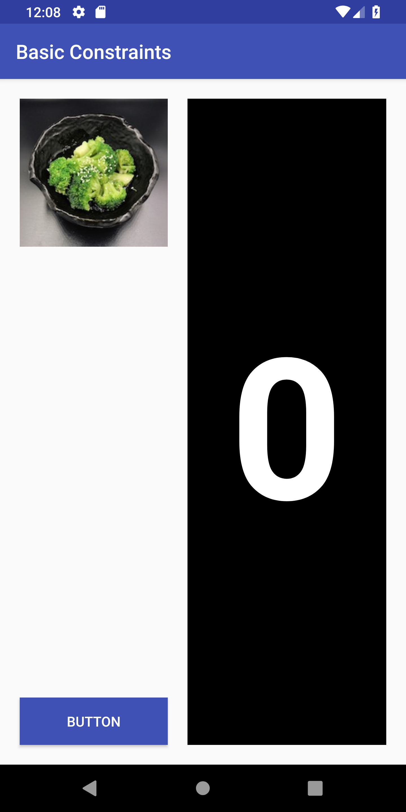
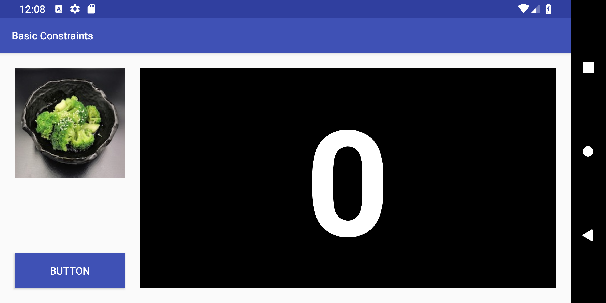
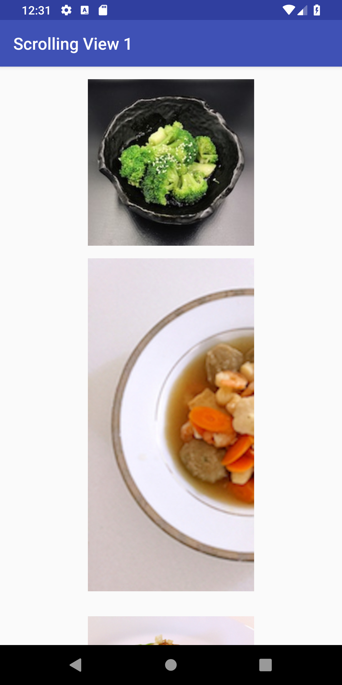
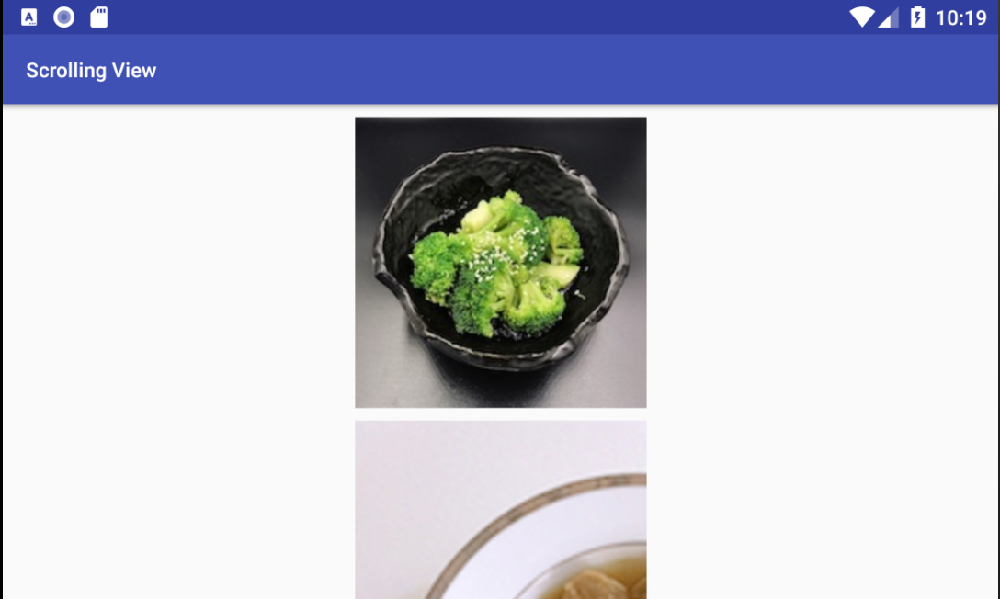
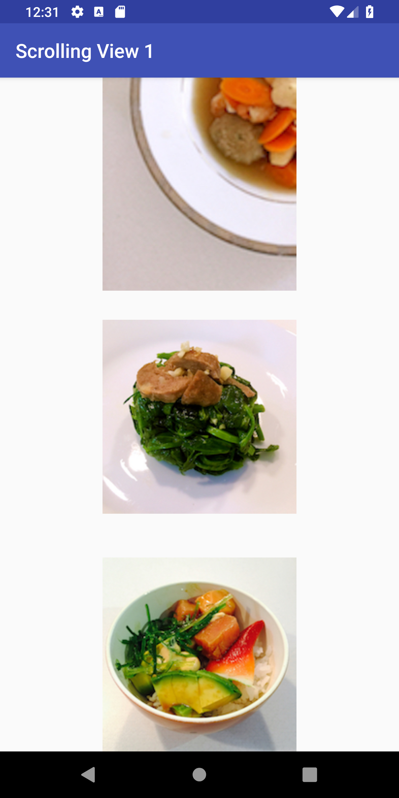
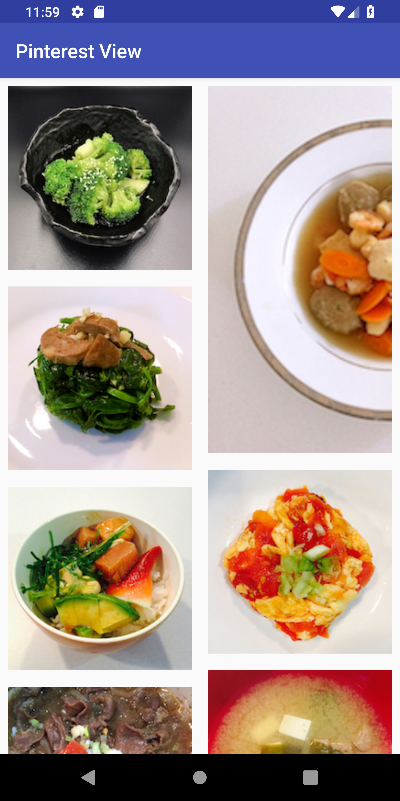
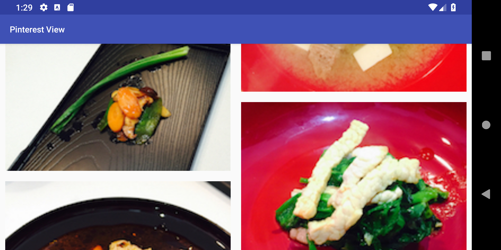
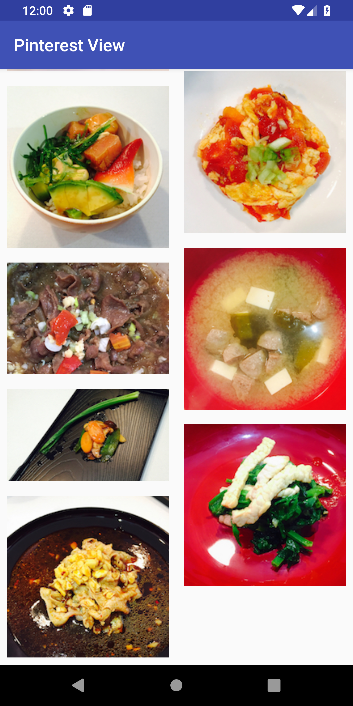

* TOC
{:toc}

# Layout Exercise

**Objective**: Use XML and programmatic constraints to replicate three layouts.

**Learning Goals**:
- Familiarize with different layout types
- Explore XML and programmatic constraints
- Handle fixed and variable size container views

**Assigned Date**: ???, 2019

**Due Date**: ???, 2019

# Part 1

Tasks:
- Create TextView, ImageView, and Button
- Constrain them for automatic portrait and landscape layouts

Create a TextView containing `0` with black background and white 200sp text. Along with it, create a button and ImageView with `food_0` which is 150dp by 150dp.

Position them as in the photo below. There should be a 20dp margin around the edges and between the textview and button/image. As the view rotates, the image and button should stay a constant size and distance from the edge while the text view expands to fill the extra space.

{:width="150px"}
{:width="300px"}

# Part 2

Tasks:
- Implement a basic scrolling view
- Add a fixed number of items with fixed constraints.

Add ImageViews for `food_0` through `food_3`. Using constraints, center them vertically and position them such that `food_0` is 15dp from the top, then each `food_i` is (15*i)dp from `food_i-1`. That is, `food_1` is 15dp below `food_0`, `food_2` is 30dp below `food_1`, and `food_3` is 45dp below `food_2`. This increasing margin layout will also be used in [Part 3](#part-3). When the layout is rotated, the images should stay the same size and remain horizontally centered.

{:width="150px"}
{:width="300px"}

{:width="150px"}


# Part 3

Tasks:
- Implement a basic scrolling view
- Add a variable number of items with programmatic constraints.

This time, we'll be adding images and constraints programmatically, but with the exact same conditions as [Part 2](#part-2). First, add a ConstraintLayout then create ImageViews for each image to add to the ScrollView. Using the same math as part 2, position the first image 15dp from the top, then the top of each image i afterward (15*i)dp from the bottom of the previous image. Again, when the layout is rotated, the images should stay the same size and remain horizontally centered.

{:width="150px"}

{:width="150px"}

{:width="150px"}

{:width="150px"}

# Part 4

Tasks:
- Implement an advanced scrolling view.
- Add a variable number of items with programmatic constraints.
- Maintain two columns and maintain the "pinterest" property.

First, create two LinearLayouts inside `part4_grid.xml`. They should equally divide the horizontal space and fill the vertical with no margins around them. These will act as our columns. When the view is rotated, the columns should stretch to maintain 50% width.

Then, programmatically add the ConstraintLayout to the Part4View. Iterate over every image name and create a corresponding ImageView. Determine which column to place it in using the "pinterest" property. That is, add the image to the shortest column or the leftmost column if they're equal. There should be a 30px margin between columns, photos, and the edges.

If using the resolution of drawables for each ImageView to determine column height, remember to normalize as actual photo resolution does not matter when determining displayed height as much as displayed size or image aspect ratio.

When rotated, the view should scale such that the images increase in size and margins remain the same.

{:width="150px"}
{:width="300px"}

{:width="150px"}

# Turnin
## Submission Instructions

Please turn in your files in the following zip structure:

```bash
YOUR_STUDENT_ID.zip
├── part1.xml
├── part2.xml
├── Part3View.java
├── Part4View.java
└── part4_grid.java
```

## Grading (10pts)

- Part 1
  - Portrait: 1pt
  - Landscape: 1pt
- Part 2
  - Portrait and Landscape: 1pt
- Part 3
  - Portrait: 1pt
  - Landscape: 1pt
- Part 4
  - Portrait: 1pt
  - Landscape: 1pt
  - Image widths and margins: 1pt
  - Correct "pinterest" column ordering: 1pt
- Turn-in and compiles: 1pt
