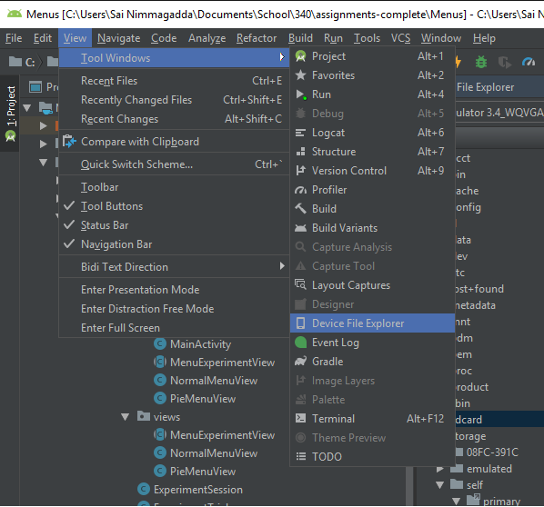

* TOC
{:toc}

# Overview of assignment

This is a two part assignment. The coding should take about 5 hours,
and re-uses many concepts from [ColorPicker](colorpicker.html). Please
start early, and reach out if you find you are spending more than 10
hours. 

The user study will take about the same. Your time will include the following:
Write your consent form using our template and print out (1 hr)
recruit, consent and run 4 participants (1-2 hours); Download your
data and importing it into the spreadsheet we provide (30 mins);
Analyze the data (1 hr) and write the report (1-2 hours). Again, reach
out if spending more than double the expected time. 

# Key Files to look at 

* ExperimentSession.java
  * Class that sets up all the conditions for the experiment and creates an iterator with all the trials.
* ExperimentTrial.java
  * Class that stores all the data for a single trial.
* MainActivity.java
  * Activity that displays the option to navigate between sessions. Also adds the corresponding menu view to the view hierarchy.
* MenuExperimentView 
  * View that can displays and handle input for a menu. This is the parent class of
    NormalMenuView and PieMenuView 
* PieMenuView 
  * View that implements pie menus
* NormalMenuView
  * View that implements normal linear menus

{:width="250px",:float="right"}
{:width="250px",:float="left"}


Here's a link to the [screen recording](https://drive.google.com/open?id=1pPl91NaUceKXKPX1GCqxgNjFVpXy3uqp) of the app.

**NOTE**: You need to be logged into your UW account to be able to view the link.

# Part 0: Overview
Read this spec and take a look at the classes listed above.

You will be implementing a class that can display a pie menu, and a
class that can display a linear menu for use in an experiment
comparing which is faster for the user to select menu items from. By
*menu items* we mean the individual items in a menu, such as the
number 1 in the sample video.

This experiment will have 6 conditions, each of which will include
`NUM_REPEATS*ITEM_MAX` trials, as follows.

|  | Menus | | 
|--|--|--|
|**Tasks** | `PIE` | `NORMAL`|
| `LINEAR`    | NUM_REPEATS*ITEM_MAX | NUM_REPEATS*ITEM_MAX| 
| `RELATIVE`  | NUM_REPEATS*ITEM_MAX | NUM_REPEATS*ITEM_MAX| 
| `UNCLASS`  | NUM_REPEATS*ITEM_MAX | NUM_REPEATS*ITEM_MAX| 

<br>
The two *menu types* (specified in an `Enum` in the code) are `PIE`
(round) and `NORMAL` (linear).

The three *task types* (also an `Enum`) are `LINEAR` (menu items such as
1,2,4,8,16,32,64,128) ; `RELATIVE` (menu items such as
Up/UpRight/Right/Down/etc...); and `UNCLASS` (menu items such as
Print/Cast/Bookmark/etc);

The *trials* are specific combinations of menu item, task type,
and menu type. So for example, one trial might involve showing the
user a pie menu, with the numbers 1..128 in it, and asking them to
select number 3. The participant can select any option, no matter what
as soon as they complete a selection, the result is recorded and the
next trial begins. 

For any given *session* (one user's worth of trials), each combination
of menu type, task type, and menu item, will be repeated `NUM_REPEATS`
times (`NUM_REPEATS` is specified in `ExperimentSession.java`). In
addition, for any specific combination of menu type and task type, at
most `ITEM_MAX` items (a total of `ITEM_MAX*NUM_REPEATS` trials) will
be shown to the user. If you set both of these to 1 for testing, you
can test all your conditions very quickly. Make sure to set them to
the required values for user testing: `NUM_REPEATS` must be at least
3, and `ITEM_MAX` must be at least 4.

In the second half (week 2) of this project, you will recruit 4
friends or students and have them complete one session each. Thus, you
will have a total of 4 (participant sessions) * 6 (conditions) *
`ITEM_MAX*NUM_REPEATS`, or 288, data points when you have completed
this assignment. You will analyze the data from this experiment in
part 2 of this project. 


We have implemented in `ExperimentSession` the code for you to generate
all of the trials from a setup file called `menuContents.csv` found in
the assets directory. Make sure that you understand the `createTrials` method 
provided in ExperimentSession.java which sets up conditions for the
whole experiment.  `ExperimentSession` is an iterator, so to run the
trials for a given session you just use `session.next` as long as
`session.getNext` is true.

# Part 1: Implement MenuExperimentView and MainActivity
**Tasks**
- Implement `onDraw` in `MenuExperimentView`
- Implement `onTouchEvent` `MenuExperimentView`
- Implement `showMenuForTrial` in `MainActivity`
- Implement `onTrialCompleted` in `MainActivity`

For this part, you will be working in `MenuExperimentView.java` and `MainActivity`. 
This section will entail defining the functions which power your menu experiment.
The `MenuExperimentView` class includes several fields that you will need to implement. You
will implement the state machine logic in `onTouchEvent` (similar to
what you've done in ColorPicker) and the logic to draw the menu in
`onDraw`. You will also implement the code necessary to add and remove
menu views from the application when a trial ends and
`onOptionSelected()` is called.

One tricky thing about context menus -- they can appear anywhere in
your user interface. To support this, we set things up so that the
menu view is going to `MATCH_PARENT` width and height. However, the
menu itself should show up right where the user presses down. This
means that you must use the provided Canvas object to correctly draw your menus.

**Handling Touch Events**

You will handle touch input by implementing the `onTouchEvent`
method. This is the event handler that is invoked when a touch occurs
in this view. Note that `onTouchEvent` is implemented in the parent
class, `MenuExperimentView` and *is not changed* in the child
classes. 

`MenuExperimentView`'s implementation of onTouchEvent makes
use of your menu's `essentialGeometry` function to determine the
relative position of the user's finger. We have provided a copy of
essentialGeometry which accepts a touch event and adjusts the coordinates
of the event so that the current finger position is sent relative to the menu's
local (0, 0) coordinate. You should not have to modify this version of `essentialGeometry`.

The state machine defined in onTouchEvent should apply to every view that you define,
with `essentialGeometry` doing the work of finding the current index. Within `onTouchEvent`,
you should define the state machine behind your menu views.

You **MUST NOT** perform any assignments within essentialGeometry, as it violates the utility
of that function. Instead, essentialGeometry should return the index associated with the desired
view, allowing the function calling it to act on that value.

- For the `PieMenu`, `essentialGeometry` should return -1 if the pointer
  has moved less than `MIN_DIST` since selection started, and
  otherwise return the item number currently being selected. Item
  number is the menu item that a ray from
  the center of the menu to the pointer intersects.
- For the `NormalMenu`, `essentialGeometry` should return -1 if the
  pointer is outside the bounds of the menu in any direction or has
  moved less than `MIN_DIST` since interaction started. Otherwise it
  should return the item number of the menu item that the pointer is
  currently inside of. 

You need to keep track of two main states: `START` and
`SELECTING`. When in the `SELECTING` state you need to distinguish
between the event type to determine if the user has selected an option
or if they are still in the middle of making a choice. 

Relevant touch events include `ACTION_DOWN`, `ACTION_MOVE`, and
`ACTION_UP`; think about how these touch events relate to the change
and how the UI should respond to these events. 


<div class="mermaid">
graph LR
S((.)) --> A((Start))
A -- "Press?startSelection()" --> I((Selecting))
I -- "Release:endSelection()" --> E[End]
I -- "Drag:dragResult()" --> I

classDef finish outline-style:double,fill:#d1e0e0,stroke:#333,stroke-width:2px;
classDef normal fill:#e6f3ff,stroke:#333,stroke-width:2px;
classDef start fill:#d1e0e0,stroke:#333,stroke-width:4px;
classDef invisible fill:#FFFFFF,stroke:#FFFFFF,color:#FFFFFF

class S invisible
class A start
class E finish
class I normal
</div>

where the actions should be as follows:

```java
startSelection() {
// 0) record starting point
// 1) call trial.startTrial(), passing it the 
// pointer position
// 2) invalidate
}
endSelection() {
// 1) call trial.endTrial(), passing it the pointer 
// position and the currently selected item
// 2) call onTrialCompleted(trial)
}
dragResult(){
// check if the item selected has changed. If so
// 1) update your menu's model
// 2) invalidate
}
```

Note that you do not need to check whether the user clicked on the
correct menu item when you call endTrial(). This data will be recorded automatically
by `ExperimentSession`.

**Implement onDraw**

For `onDraw()`, your will do some setup that will allow your
subclasses to draw properly. First, you will need to check if you are
in the proper state to draw (you should only draw when in the `SELECTING`
state).

Next, you really want to draw from the (0,0) location of the menu,
rather than the (0,0) of the parent. But remember that your width and
height are set using `MATCH_PARENT`. To fix this, we need to change
the coordinate system of the canvas so that (0,0) is at the
`startPoint` for this interaction.

Finally, since this is an abstract class, we need to call the *real*
drawing method, which our children will implement. This is called
`drawMenu()` and should be overridden by `PieMenuView` and
`NormalMenuView`.  Therefore, your `onDraw` implementation in
`MenuExperimentView.java` will be pretty short.

<!-- would it make sense to contain everything inside of onDraw? pass the canvas into the superclass and use that to modify the coords, then go on like nothing happened -->

The starter code contains several fields that are 
useful for drawing the menus on screen. For PieMenu, the given `RADIUS`
corresponds to the outer radius. The inner radius is defined by `RADIUS - TEXT_SIZE * 2`.
Furthermore, be sure to check the `MenuExperimentView` starter code for any additional values that you should use when creating your menus.

**MainActivity**

In MainActivity you will implement the method
`showMenuForTrial(ExperimentTrial trial)`. This method will create a
new `MenuExperimentView` of the type specified in the trial, set its
layout parameters so that it fills its parent and is visible on the
screen, and register a callback with it that knows what to do when a
trial is completed.

<!-- The solution code makes use of functional interfaces (MainActivity line 86),
     it's solvable without but should we mention this somewhere in the docs? -->

MainActivity also needs to implement the code to respond to
`onTrialCompleted`, a method of the TrialListener interface defined
in `MenuExperimentView`. In particular, this code should always remove the
current menu being shown. Then it should check if the session is
over (remember the session is an iterator), and if not call
`showMenuForTrial` with the next trial. If the session is over, it
should update text of `InstructionTextView` to say that the session is
completed. This means that until the next session is started, the system should not display any menus
if the user clicks. You can also display a
[Toast](https://developer.android.com/guide/topics/ui/notifiers/toasts).  

**Related APIS**

* [View](https://developer.android.com/reference/android/view/View#drawing): See documentation on Drawing
* [MouseEvent Constants](https://developer.android.com/reference/android/view/MotionEvent#constants_2)

# Part 2: Implement Pie and Normal Menus

**Tasks**

- `PieMenuView`: Implement `essentialGeometry` and `drawMenu`
- `NormalMenuView`: Implement `essentialGeometry` and `drawMenu`

Both `PieMenuView` and `NormalMenuView` extend `MenuExperimentView`. You
will implement `essentialGeometry` for each and determine what menu item the
touch event maps to. You'll have to come up with the math logic to map
from touch event to an item index. 

You will also implement `drawMenu` which at a minimum draws the menus as shown in
the screenshots. If you want to do something different, you may, as
long as the size and position of each menu item does not change. For
example, you can  override the paint properties defined in
`MenuExperimentView`, position the text differently, or draw more
decorations on the menus. 

The radius of the circle in the pie menu is `RADIUS - TEXT_SIZE * 2`.
The width of each item in the normal menu is `CELL_WIDTH` and the height is
`CELL_HEIGHT`.

In the event that part of your menu may appear off-screen, you should adjust its
start point to ensure that the entire menu is legible and accessible. If part of
the user's finger is over a menu item as a result, then you should select that index
when you draw the menu.

## Some hints for the pie menu

- `drawArc` will draw a pizza-pie shaped arc, so you can do things
  like highlight a menu item with a single method call. 
- You will need a rotational offset to ensure the top menu item is at
  the top of the pie (both when drawing and in essential geometry)
  because angle is traditionally measured from cardinal east. You can
  add this in radians before converting from angle to index. 
- Check your color picker submission for some advice on setting up
  the `essentialGeometry` function for `PieMenuView`.
- Your pie menu text does not need to be centered -- as long as it
  is contained within the outer ring of the pie menu, you are fine.


 
**Related APIs**
* [Canvas](https://developer.android.com/reference/android/graphics/Canvas): See documentation on drawCircle and drawText.
* [Path](https://developer.android.com/reference/android/graphics/Path): For adding text along a curve

## Extra Credit Opportunity

For extra credit on this assignment, you may complete one of the following:

* Make one of our menus accessible! Using the concepts discussed in the accessibility assignment, find a way to make our Pie menu / Normal menu accessible. This may be a challenge, as we are drawing our menu elements with the Canvas as opposed to defining them as individual views. You are definitely encouraged to look around the Android API for solutions here, as well as share anything that you come across.

* Create a new menu! Working off of the provided `MenuExperimentView` interface, build your own third menu. This menu should be different from the Pie/Normal menus. You are encouraged to explore user interactions here, and you will receive credit as long as your code shows significant effort. Your menu does not have to be great here -- if you choose, you can aim to create the "worst menu ever" for this submission. Alternatively, you can aim to outcompete our provided menu views! (you do not need to display this menu in your experiment -- however, if you want to do so and analyse the data separately, you are certainly encouraged to!)

# Part 3: Conduct and Write Up User Study

**Tasks**
- Conduct user study 
 - Run a trial on yourself
 - Create a final consent form from [this sample](consent.html)
 - Recruit 4 participants
 - Have them sign your consent form
 - Have them complete a session with `MAX_ITEMS` set to at least 4 and
   `NUM_REPEATS` set to 3. 
 - Download the recorded data 
- Analyze recorded data 
- Write a report

**Conduct User Study**

To finalize the [consent form](consent.html), you will need to copy over the text from
our sample consent form and modify it in all of the places marked as
such. You should print out two copies of the consent form for each
participant -- one for them and one for you.

You will need to try out your own program as a participant to fill in
the consent form (since you'll need to know how long it takes). This is
also a good time to double check that your data is not lost by
downloading it.

*Downloading your data*

On mac OS X, `adb pull /storage/emulated/0/CSE340_PieMenu/TestResult.csv` will
download your data to the current directory you are in (or you can
specify a location).

On some devices, this file is instead located inside `/sdcard/CSE340_PieMenu/TestResult.csv`.
If the above command does not work, try searching this directory as well.

On all platforms, if you have Android Studio installed you can use
a tool window called `Device File Manager`. This allows you to directly
access the files on your Android device (emulated or physical) through a
GUI window. If you aren't comfortable with using adb over the the command line,
or if you are having trouble locating the file, this is a great option.

1) Connect your Android device. If you use an emulator just start the emulator like
you usually would. If you use a physical device connect it to your computer over
USB like you usually would when loading your Android apps.

2) In the top menu, press View -> Tool Windows -> Device File Explorer. This will
open a window that details the contents of your Android device's file system.

{:float="left"}

3) Navigate to `/storage/emulated/0/CSE340_PieMenu/TestResult.csv`. You should be able
to open the file and even save it elsewhere on your computer's file system. 

*Create a clean CSV* 

You should use the hamburger menu in the app you just implemented to `Clear Result CSV`
before starting your study so that your data does not contaminate your results. **Make sure that you do not clear the results between submissions!** This will erase your trial data.

Our implementation uses the ExperimentSession object to create, manage, and record experiment data to the CSV. If you are interested, check out the recordResult function on line 213 of ExperimentSession.java (as always, modify at your own risk!)

*Recruit participants and have them sign your consent form* 

You can ask friends or classmates for help. Do
not *coerce* anyone into participating in your study. Make sure they
know they have a choice, and have read and signed the consent
form. You will be required to *turn in signed consent forms* with your
report. The language used in your consent form is key, so ensure that it does not come off as forceful or coercive.

*Collect data* 

Have each participant complete a session. Once *all*
participants are done, you and download your final data file. It
should have 72*4 (288) data points in it. You can use the emulator or your
phone for this, and any mouse you want. You will need to turn in your
final data file with your report. 

**Write a Report**

You will need to write up a brief report about your study. We 
provide a [template](menu-report).

# Submission Instructions

You will turn in the following files [here](https://gitgrade.cs.washington.edu/student/assignment/49/turnin):

Part 1: 
- MainActivity.java
- MenuExperimentView.java
- NormalMenuView.java
- PieMenuView.java

Part 2: 
- TestResult.csv
- Signed consent forms (images/scans)
- Report.pdf

## Grading (10 pts)

- First Half (4 points)
  - State machine implementation works: 1
  - Correctly implements essentialGeometry in NormalMenu and PieMenu: 1
  - Correctly implements drawMenu in NormalMenu and PieMenu: 1
  - Correctly handles trials and callbacks in MainActivity: 1
- Turn-in and compiles: 1pt
- Second Half (5 points)
  - Have reasonable CSV output and charts: 1pt
  - Have signed consent forms: 1pt
  - Report:
    - Description of study process: 1pt
    - Demonstrate understanding of results: 1pt
    - Draw appropriate conclusions about linear vs. pie menu: 1pt
- Extra credit submission: 1pt
