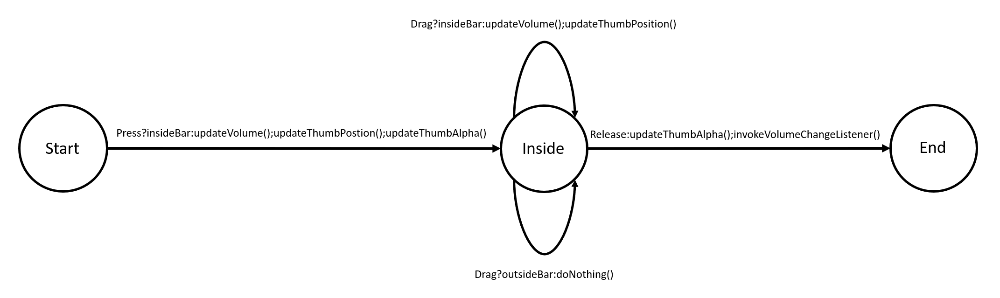

# How to turn the PPS into code

The code implementation should spiritually follow the PPS; that is, your code should only take action when moving from state to state (along the arrows in the PPS). This behavior is best represented by a `switch` statement, where each `case` represents a state in our PPS. Within each `case`, there can be nested `if` statement to handle transitioning to another state. 

Each `case` should be broken out of and should properly handle input, propogating input to later views or stopping the input propogration as necessary. We typically do this through the `onTouchEvent` method. In `onTouchEvent`, returning `true` will stop the input propogation to views below it, while returning `false` allows views below it to handle the event.

## Volume example



```java
@Override
public boolean onTouchEvent(MotionEvent event) {
    EssentialGeometry geometry = essentialGeometry(event);
    switch(mState) {
        case START:
            if (event.getAction() == MotionEvent.ACTION_DOWN && geometry == EssentialGeometry.BAR) {
                mState = State.INSIDE;
                updateThumbPosition();
                updateThumbAlpha();
                updateVolume();
                invalidate();
                return true;
            }
            break;
        case INSIDE:
            if (event.getAction() == MotionEvent.ACTION_MOVE && geometry == EssentialGeometry.BAR) {
                updateThumbPosition();
                updateVolume();                
                invalidate();
                return true;
            } else if (event.getAction() == MotionEvent.ACTION_UP) {
                mState = State.START;
                updateThumbAlpha();
                invokeVolumeChangeListener();
                invalidate();
                return true;                   
            }
            break;
        default:
            break;
    }
    return false;
}
```
In the above code snippet, `updateThumb()` would handle determining and setting the opacity of the thumb, while `updateVolume()` would similarly update the volume based on the position of your finger. Function calls inside the switch cases should be used to break up the logic in complicated situations or where the same logic can be used for multiple transitions.