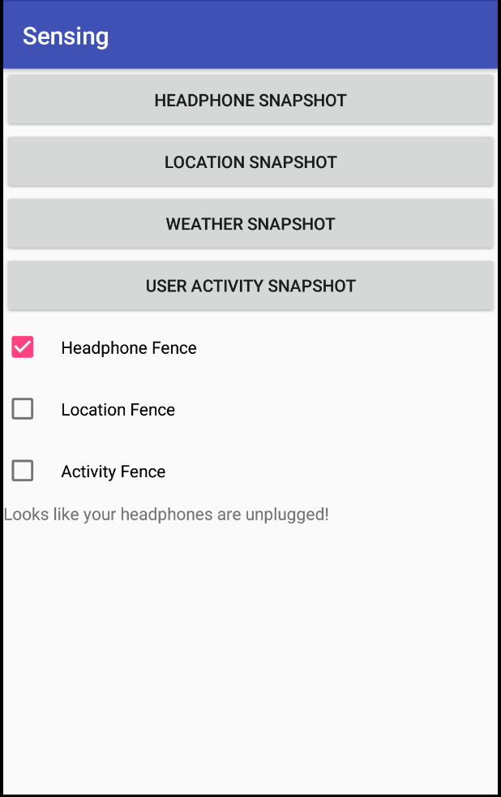

- TOC
{:toc}

Tasks:
- Add snapshot support for the following sensors:
  - Headphone
  - Location
  - User Activity
- Use fence suppor to listen for changes to the following sensors:
  - Location (detect whether in CSE)
  - Activity (detect whether walking)
- Create an app that responds to implicit data (i.e. reacts to a change in context)

Context awareness capabilities enable mobile phones to sense their physical environment and adapt their behavior accordingly. You can practice how to load and react to data from different sensors in this exercise, as the preparation to build context aware app in the final assignment. 

According to Google, "[The Awareness API](https://developers.google.com/awareness/) unifies 7 location and context signals in a single API, enabling you to create powerful context-based features with minimal impact on system resources."

It supports combining and working with 7 signals including time, location, places, beacons, headphones, activity and weather. 

There are two ways to get context from sensors: `Snapshot` and `Fence`
- Snapshot will return the most recent (may not be realtime) information from sensor.
- Fence will be triggered when the sensor data changes (based on the signal conditions you set). You may also combine multiple conditions to create a smarter fence.

We already provide example code to get weather, using snapshot, and headphone state, using fence. Your job will be to add additional sensors

# Preparing to run the app
You will need to set some things up

<!--
## Get your API Key

Follow the ["Quick Guide"](https://developers.google.com/places/web-service/get-api-key)
To use this guide, you will be asked at some point about whether you want to create a new app (the answer is yes, name it something like cse340-LaughingChipmunks, or whatever your repository name is, the names have to be unique).

You'll be asked to set up a billing account. However, for the minor use in this class, it shouldn't cost you anything. If this is a problem at all (e.g. you don't have a credit card), please reach out privately on Piazza.

When the interface gives you your API key **copy it and don't lose it**. That is the only time you'll ever see it for security reasons, you'll have to create a new app if you lose it.

When you have your API key, go to your android manifest and paste it in between the quotation marks labeled API_KEY.

```xml
<meta-data
     android:name="com.google.android.geo.API_KEY"
     android:value="YOUR KEY HERE"/>
```	    

## For advanced awareness things (optional)

You'll need to enable one more API than the automated quick guide does for you. This is the *awareness api*. To enable it, search for it in the search bar as shown here:


Click on the search result, and select **Enable.** You'll then need to click on the **Create Credentials** button and create credentials. Again, you'll get an API string which you'll need to add to your manifest, in the other API KEY meta data (just below the geo one). 
-->

## What the app looks liken

Here are sample screenshots for sensor results:

{:width="200px"}
{:width="200px"}
{:width="200px"}
{:width="200px"}
{:width="200px"}
{:width="200px"}
{:width="200px"}
{:width="200px"}


## Create your own implicit application
You should create an application that makes use of at least one sensor
to do something implicitly. 

## Simulating input if using an emulator
To test your app, you will need to either use a real phone or
[simulation
capabilities](https://developer.android.com/studio/run/emulator#extended)
built into the emulator. You bring it up by clicking on the "..."
shown in red in the bottom right of the below image.

{:width="400px"}

Using this you can simulate location, either current location or a
whole route. To simulate a route, you can upload gps traces to
simulate motion over time. A 
good place to download sample traces is [OpenStreetMap's traces
page](https://www.openstreetmap.org/traces/). If you want to double
check the results of location, here are [instructions on how to find a
place in google maps using
lat/long](https://support.google.com/maps/answer/18539?co=GENIE.Platform%3DDesktop&hl=en)

You can also create your own route by modifing the lat/long in a trace
(or making your own from scratch using the [GPS exchange
format](https://en.wikipedia.org/wiki/GPS_Exchange_Format) 

You can also simulate weather (find it in the 'Virtual sensors' part
of the simulator). 

You can simulate headphones in the 'Microphone' tab of the simulator.

We have not found a way to simulate activity.

# Files provided
The files provided are 

```
Snapshot:
ContextSnapshotActivity.java
WeatherSnapshotActivity.java (inherits from ContextSnapshotActivity.java)

Fence:
FenceActivity.java
FenceBroadcastReceiver.java 
HeadphoneFenceActivity.java (inherits from FenceActivity.java)
```

All snapshots should inherit from `ContextSnapshotActivity.java`. This
file provides a method `setSnapshotListener(Task t, SnapshotListener sl)` that you will need to
call from `onCreate()`, providing a `snapshotListener`. Your listener should then
respond to the input, by drawing text on the screen in the case of the
assigned sensor implementations. Note that if your sensor uses
location, you have to check permissions as demonstrated in `WeatherSnapshotActivity.java`

All fences should inherit from `FenceActivity.java`.
This class provides a method `setupFence(AwarenessFence during,
AwarenessFence starting, AwarenessFence stopping, String fenceName,
FenceActivityListener l)` which you will call from `onCreate()`. Again
pay attention to permissions. 


# Turn-in

## Submission Instructions

You will turn in the following files <a href="javascript:alert('Turn-in link pending assignment release');">here</a>:

```
- ActivityFenceActivity.java
- LocationFenceActivity.java
- ActivitySnapshotActivity.java
- LocationSnapshotActivity.java
- HeadphoneSnapshotActivity.java
```

You may also change:
```
- strings.xml
- activity_main.xml
- Any class you create that did not previously exist
```

## Grading (10pts)

- Get API Keys: 1pt
- Location: 1pt
- Place: 1pt
- Weather: 1pt
- Activity: 1pt
- Location Fence: 2pt
- Activity Fence: 2pt
- Code Organization and Style: 1 pt
