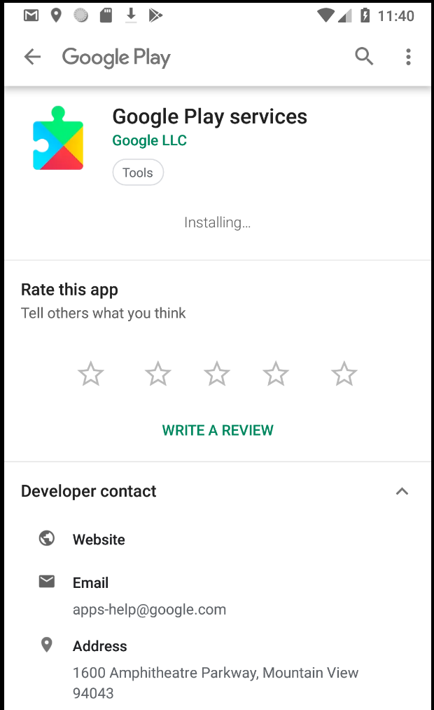
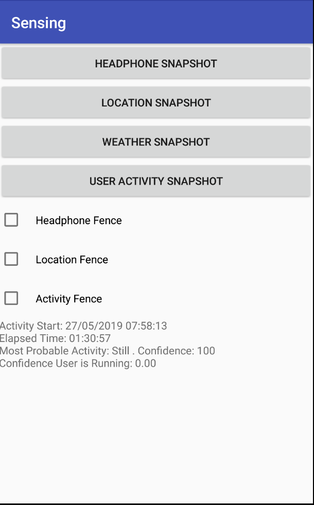
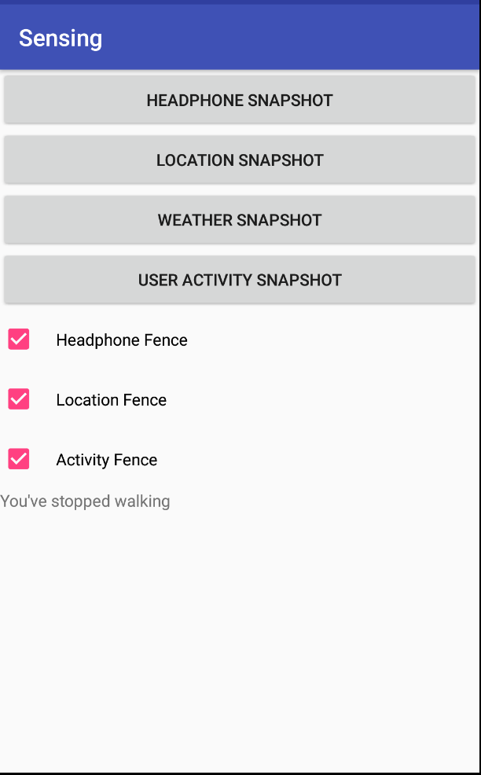

- TOC
{:toc}

This is part 1 of a group assignment. You should get this working on
your own, but then work as a group to make an app that uses sensed
data. Every group will have one person with an android phone, or
access to an android phone, and you should work together to make sure
individual group members can all test their part 1 code using the
group phone.

Tasks:
- Add snapshot support for the following sensors:
  - Headphone
  - Location
  - User Activity
- Use fence support to listen for changes to the following sensors:
  - Location (detect whether in CSE)
  - Activity (detect whether walking)
- Create an app that responds to implicit data (i.e. reacts to a change in context)

Context awareness capabilities enable mobile phones to sense their physical environment and adapt their behavior accordingly. You can practice how to load and react to data from different sensors in this exercise, as the preparation to build context aware app in the final assignment. 

According to Google, "[The Awareness API](https://developers.google.com/awareness/) unifies 7 location and context signals in a single API, enabling you to create powerful context-based features with minimal impact on system resources."

It supports combining and working with 7 signals including time, location, places, beacons, headphones, activity and weather. 

There are two ways to get context from sensors: `Snapshot` and `Fence`
- Snapshot will return the most recent (may not be realtime) information from sensor.
- Fence will be triggered when the sensor data changes (based on the signal conditions you set). You may also combine multiple conditions to create a smarter fence.

We already provide example code to get weather, using snapshot, and headphone state, using fence. Your job will be to add additional sensors

# Preparing to run the app
You will need to set some things up

## 1) Get your API Key and put it in the app Manifest.xml

Follow the ["Quick Guide"](https://developers.google.com/places/web-service/get-api-key)
To use this guide, you will be asked at some point about whether you want to create a new app (the answer is yes, name it something like cse340-LaughingChipmunks, or whatever your repository name is, the names have to be unique).

You'll be asked to set up a billing account. However, for the minor use in this class, it shouldn't cost you anything. If this is a problem at all (e.g. you don't have a credit card), please reach out privately on Piazza.

When the interface gives you your API key **copy it and don't lose it**. That is the only time you'll ever see it for security reasons, you'll have to create a new app if you lose it.

When you have your API key, go to your android manifest and paste it in between the quotation marks labeled `YOUR_KEY_HERE`.

```xml
        <meta-data
            android:name="com.google.android.awareness.API_KEY"
            android:value="YOUR_KEY_HERE"/>
        <meta-data
            android:name="com.google.android.geo.API_KEY"
            android:value="YOUR_KEY_HERE"/>
```

If you have a hard time with this, contact us on Piazza, and we will
provide you with a key. However it should be used for this assignment
only, not for future android programming, and not shared with anyone
else. 

## 2) Prepare a virtual device that is based on Oreo (API v. 26) 

## 3) Run your app and update things

1) Allow location permissions

<!-- TODO: Why do these use px dimensions? They should use [:img alt, XX%] for better mobile support -->
{:width="200px"} 

2) Click on 'User Activity Snapshot'. This will cause an error telling
you that play needs to be enabled as shown here. If it goes away (it's
a notification), just click the same button again. 

{:width="200px"} 

3) When you click on the notification, it will take you to a sign in
screen for play store. Sign in using your google account. Agree to the
terms of service; you don't have to agree to back up to google drive
though (just turn that off by moving the slider and then press agree)

4) When it sends you back to your app, press on the square button at
the bottom of the screen and switch back to google play services. 

{:width="200px"} 

Android will show a big 'Update' button or you can just wait and it will
download and update, as shown here:

{:width="200px"} 

5) Switch back to your app again and press 'User Activity
Snapshot'. Wait patiently. Rejoice when you see the following (or
something similar)

{:width="200px"} 

## For advanced awareness things (optional)

You'll need to enable one more API than the automated quick guide does for you. This is the *awareness api*. To enable it, search for it in the search bar as shown here:


Click on the search result, and select **Enable.** You'll then need to click on the **Create Credentials** button and create credentials. Again, you'll get an API string which you'll need to add to your manifest, in the other API KEY meta data (just below the geo one). 


## What the app looks liken

Here are sample screenshots for sensor results:

<span style="color: red;">Note: the weather screenshots display `&#x2103` where they should display °</span>

{:width="200px"}
{:width="200px"}
{:width="200px"}
{:width="200px"}
{:width="200px"}
{:width="200px"}
{:width="200px"}
{:width="200px"}

Here is a [link to a video of it in
use](https://youtu.be/oF0i2lL4EUE).

<span style="color: red;">Note: the video does not exhibit the updated behavior of fences prepending text to the beginning of the existing text</span>

## Simulating input if using an emulator
Although we ask that the group member with the phone donate phone time
for testing, you should start by testing your code with the emulator,
and should be able to  reproduce this video. 

To test your app, first use the 
[simulation
capabilities](https://developer.android.com/studio/run/emulator#extended)
built into the emulator. You bring it up by clicking on the "..."
shown in red in the bottom right of the below image. Note that this is
buggy -- it doesn't always work, sometimes it is slow, and it doesn't
always update when you want. According to the [Awareness Fence Troubleshooting
page](https://developer.android.com/training/location/geofencing#Troubleshooting),

*Alerts can be late. The geofence service doesn't continuously
query for location, so expect some latency when receiving
alerts. Usually the latency is less than 2 minutes, even less when the
device has been moving. If Background Location Limits are in effect,
the latency is about 2-3 minutes on average. If the device has been
stationary for a significant period of time, the latency may increase
(up to 6 minutes).*{:.quote}

Location changes are generally only
registered if you switch to maps in the emulator, and then back to
your app. Otherwise you will get a timeout error for location, and
weather (which depends upon location).

Despite all this, the emulator is still useful because it can help you make sure your code
doesn't crash. 

### Location Simulation
{:width="400px"}

### Headphone Simulation
{:width="400px"}

### Weather Simulation
{:width="400px"}

Using this you can in principal simulate location, either current location or a
whole route. To simulate a route, you can upload gps traces to
simulate motion over time. [Here](sensing/Test.gpx) is one that moves in and out of CSE. A good place to download sample traces is
[OpenStreetMap's traces
page](https://www.openstreetmap.org/traces/). If you want to double
check the results of location, here are [instructions on how to find a
place in google maps using
lat/long](https://support.google.com/maps/answer/18539?co=GENIE.Platform%3DDesktop&hl=en) 
You can also create your own route by modifing the lat/long in a trace
(or making your own from scratch using the [GPS exchange
format](https://en.wikipedia.org/wiki/GPS_Exchange_Format) **HOWEVER**
we were not able to get this working with the Sensing app and suspect
a bug in the emulator.

You can also simulate weather (find it in the 'Virtual sensors' part
of the simulator). **HOWEVER** again this doesn't seem to be reflected
in the sensing app, potentially due to a bug.

You can simulate headphones in the 'Microphone' tab of the
simulator. **GOOD NEWS** this should work both for testing your
headphones snapshot and headphones fence.

We have not found a way to simulate activity.

# Files provided
The files provided are 

```
Snapshot:
ActivitySnapshotListener.java

Fence:
ActivityFenceListener.java
FenceBroadcastReceiver.java 
```

The files you will implement are:

```
Snapshot:
HeadphoneSnapshotListener.java
LocationSnapshotListener.java
WeatherSnapshotListener.java

Fence:
HeadphoneFenceListener.java
LocationFenceListener.java

MainActivity.java
```

### Snapshot implementation
All SnapshotListeners should implement
ContextActivity.SnapshotListener. They should 
respond to the input received via `onSnapshot(Response response)`, 
by drawing text on the screen in the update
`TextView`. 

The `Response` object will contain the specific information to
display.

### Fence implementattion
For fences to work, you will need to implement
`setupFenceListeners()` in `MainActivity.java`. In addition, you will
need to complete the implementation of the two `FenceListener`
classes, `HeadphoneFenceListener.java` and `LocationFenceListener.java`

All fences should inherit from `FenceBroadcastReceiver.java` and
implement
`FenceBroadcastReceiver.FenceActivityListener`. They will need to
implement three methods that respond to fence updates:
`during(FenceState state)`, 
`starting(FenceState state)` and `stopping(FenceState state)` by updating text on the screen in
the update `TextView`. 

The information to display will depend on the fence state. You will
have to interpret this based on your knowledge of what you did to set
up the fence. For instance, the locations given for the location fence
will result in `state = FenceState.TRUE` in when `duringFence()` is
called while the user is inside of the CSE building.

There are detailed comments in the code files you will implement that will direct you through the assignment.

# Turn-in

## Submission Instructions

You will turn in the following files [here](https://gitgrade.cs.washington.edu/student/assignment/64/turnin):

```
- HeadphoneSnapshotListener.java
- LocationSnapshotListener.java
- WeatherSnapshotListener.java
- HeadphoneFenceListener.java
- LocationFenceListener.java
- MainActivity.java
```

You may also change:
```
- strings.xml
- activity_main.xml
- Any class you create that did not previously exist
```

## Grading (5pts)

- Get API Keys: 1pt
- Snapshots all work: 
 - Location: .5pt
 - Headphone: .5pt
 - Weather: .5pt
- Fences all work:
 - Headphone .5pt
 - Location .5pt
- MainActivity sets things up correctly: .5pt
- Code Organization and Style: 1 pt
