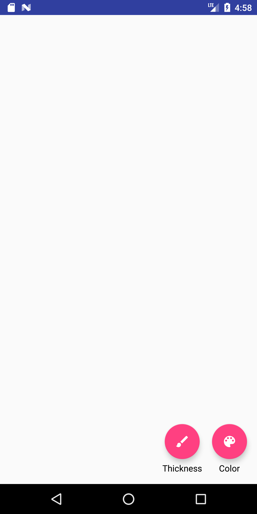

- TOC
{:toc}

Tasks:
- Handle undo/redo operations (required)
- Add a feature to your app (required)
 - Make sure it is accessible
- Improve usability of your app (optional)
 - Try to identify at least one usability problem and address it 

# Explanation of how codebase works
This is one of the more complex programs we are giving you in terms of
code, it is a fairly functional application.

Here is the interactor hierarchy initially. The FAB subtrees are the
menus at the bottom of the screen, made up of one or more floating
action buttons. The `DrawingView` is the place where drawing takes
place. Each new stroke is saved as a separate, new `StrokeView` added
to the `DrawingView`.

The initial interactor hierarchy at instantiation looks like this
(shown at the side is a legend for the visibility status of different
interactors). Hidden means on screen and drawn but hidden behind
something else. 

<div class="mermaid">
graph TD
M[MainActivity] --> D[DrawingView]
M --> FUndo[FAB:Undo]
M --> FRedo[FAB:Redo]
M --> FColor[FAB:Color]
M --> FThick[FAB:Thickness]
FColor --> Red[Red]
FColor --> Green[Green]
FColor --> Blue[Blue]
FThick --> Thin[Thin]
FThick --> Med[Med]
FThick --> Thick[Thick]

Vis[Visible] --> In[Invisible]
In --> Hid[Hidden]

classDef normal fill:#e6f3ff,stroke:#333,stroke-width:2px;
classDef start fill:#d1e0e0,stroke:#333,stroke-width:4px;

class M,D,FColor,FThick,Vis start
class Red,Green,Blue,Thin,Med,Thick,Hid normal
</div>

When the user draws on screen (by clicking and dragging inside the
`DrawingView`, this adds a new `StrokeView` to the interface. Notice
that the `Undo` button is now visible instead of visible because there
is an action to undo. 

<div class="mermaid">
graph TD
M[MainActivity] --> D[DrawingView]
D --> Stroke1[StrokeView]
M --> FUndo[FAB:Undo]
M --> FRedo[FAB:Redo]
M --> FColor[FAB:Color]
M --> FThick[FAB:Thickness]
FColor --> Red[Red]
FColor --> Green[Green]
FColor --> Blue[Blue]
FThick --> Thin[Thin]
FThick --> Med[Med]
FThick --> Thick[Thick]
Vis[Visible] --> In[Invisible]
In --> Hid[Hidden]

classDef normal fill:#e6f3ff,stroke:#333,stroke-width:2px;
classDef start fill:#d1e0e0,stroke:#333,stroke-width:4px;

class M,D,Stroke1,FUndo,FColor,FThick,Vis start
class Red,Green,Blue,Thin,Med,Thick,Hid normal
</div>

The sequence in the interface:

 


You can play around with the interface to change color and
thickness. Each new stroke you add adds another `StrokeView` to the interface. 

# Undo/Redo Operations

## TBD still writing!!!
There should be a limit on how many actions one can undo or redo. You
should only allow up to 10 commands to undo and up to 10 commands to
redo.


# Adding a feature
You can add any feature you want to the app. However, we have some suggestions that will help guide you.

- The simplest possible thing you could do is add a FAB to one of the existing menus. This would let you for example add a new color option. 
- A more complex choice would be to replace the color option with something that calls your color picker. If you do this, try to make sure it is really round, meaning that if you click in a corner of its bounding box outside the color wheel, the right thing happens (a stroke starts in the underlying drawing view)
- You could do something even more complex like allow the user to change the location of a stroke by dragging it. This is quite hard because you have to modify the command object and undo infrastructure, as well as adding new event handling capabilities to StrokeView. 

To provide guidance on this, we will focus specifically on how to add
a FAB to one of the existing menus. Other things that you may want to
do will require you to read and understand the code, which we have
commented, or ask questions in office hours.

## Adding a FAB to an existing menu


The FABs in this assignment refer to [Floating Action
Buttons](https://developer.android.com/reference/com/google/android/material/floatingactionbutton/FloatingActionButton.html). 

There
are two main things you will need to do to add one.

First, you will need to decide whether you are adding a color or a
thickness, and then find the right place in `activity_main.xml` to
modify. For example, this is the XML in that file for the thickest FAB
Action Button:

```XML
 <android.support.design.widget.FloatingActionButton
            android:id="@+id/fab_thickness_2"
            android:layout_width="40dp"
            android:layout_height="40dp"
            android:layout_gravity="bottom|center"
            android:layout_marginBottom="20dp"
            app:srcCompat="@drawable/thickness_2" />
```

Next, you will need to add this to `actionButtons` in
`MainActivity.java` and correctly update `bsetupActionButtons(actionButtons, new View.OnClickListener() {...})`
In order to change the switch statement in `setupActionButtons`,
however, you will need to make sure that `DrawingEvent.java` has an
appropriate constant for your new button. For example, you may need to
add a constant for `COLOR_YELLOW` if you are adding a FAB for
selecting yellow. 


# Improving usability
As with adding a feature, there are several options here. Some examples of things *I* think are usability issues. You may not agree, if you choose to do this, you should focus on something *you* think is a usability issue. 
- As a color is selected and after the color is selected, the color FAB
 should update its background to that color.
- When a thickness is picked, the thickness FAB should update its icon
 to indicate the thickness selected.
- When a thickness or color is selected, the menu should immediately
  collapse down to a single FAB
- Some might find the menu items small and hard to select  
- No saving of state between invocations of the application. Could use
  bundle to do this. 

# Peer grading: Heuristic evaluation

This will take place in lab on Thursday May 23rd, 2019, and be due over the next 24
hours as with the previous peer grading exercise

The Task:
- Step 1: draw something
- Step 2: undo
- Step 3: use menu to change color
- Step 4: try to redo
- Step 4: draw something
- Step 5: use new feature
- Step 6: undo and redo

You will take notes on paper about issues you run into. When you have
completed all the tasks, you will fill out a survey with the 3 most
severe issues. This will include questions about:
- Who are you/ who are you evaluating
- Which task step (above)
- Which heuristics are violated (primary and secondary)
- What severity rating would you give it
- Take a picture if you can
- Describe what happened

You will also tell us if they customized a command and what it
was. You will submit 3 things for each of 3 handins. 

# Turn-in

## Submission Instructions

You will turn in the following files <a href="javascript:alert('Turn-in link pending assignment release');">here</a>:

```
- ...
```

## Grading (10pts)

- Part 1: Implementation
  - New feature
   - Accessible: 1pt
   - Works: 1 pt
  - Undo and redo works in general: 1pt
  - Edge cases in undo/redo works: 1pt
- Part 2: Peer grading
  - Support one additional command: 1pt
  - Complete heuristic evaluation for other students: 2pt
  - No severe usability issues: 1pt
- Code Organization and Style: 1 pt
