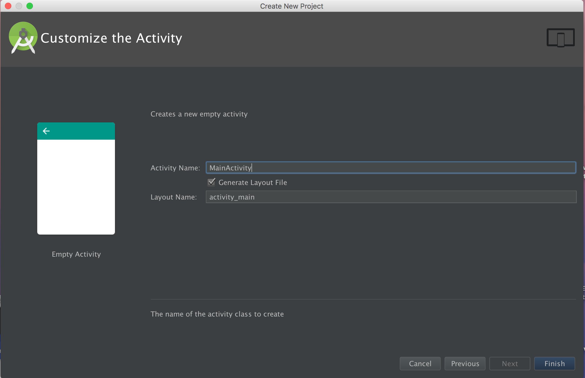
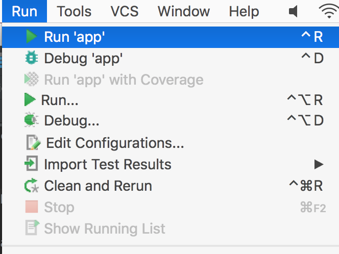
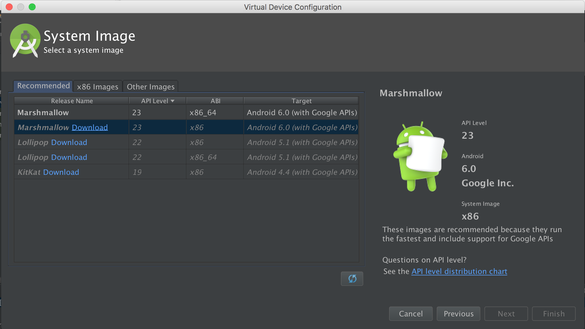

name: inverse
layout: true
class: center, middle, inverse
---
# SSUI Mobile Lab (Fall 2016)
## Week 1: Development Environment Setup

.title-slide-logo[
  
]
Instructor: Michael Rivera  
_{mlrivera@cs.cmu.edu}_  

Slides online: [https://mikeriv.com/ssui-2016](https://mikeriv.com/ssui-2016)
---
layout: false

# Overview
- ## Android Studio Installation

- ## Android SDK Installation

- ## Exercise: Hello World
---

layout: false
## Development Environment Setup

--

- Download + Install

  - __Android Studio__:  
    https://developer.android.com/studio/index.html
--

  - __Genymotion Android Emulator__ *(Optional)* :   https://www.genymotion.com/thank-you-freemium/
--

- Android Set-up
--
  - Open Android Studio

---

template: inverse
## Android Studio Walk-through

---

### Starting Android an Android Project
.full-width-img[
  
]

---

### Project Configuration

.full-width-img[
  
]
---

### Targeting Android Devices

.full-width-img[
  
  ]
---

### Adding an Activity

.full-width-img[
  
]
---  

### Customizing the Activity

.full-width-img[
  
  ]
---

### Viewing your Activity's Code

.full-width-img[
  
  ]
---

### Running your Application
.full-width-img[
  
  ]

---
### Selecting a Deployment Target
.full-width-img[
  
  ]

---
### Configuring a Virtual Device (Install Marshmallow)
.full-width-img[
  
  ]

---
### Let the Installer Run (Grab some Coffee)
.full-width-img[
  
  ]

---
### Configuring a Virtual Device - Select a Phone
.full-width-img[
  
  ]

---
### Configuring a Virtual Device - Naming your Device
.full-width-img[
  
  ]

---

### Selecting a Deployment Target
.full-width-img[
  
  ]

---
### Start your Application!
.half-width-img[
  
  ]
