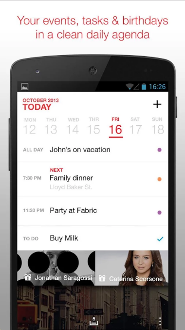

name: inverse
layout: true
class: center, middle, inverse
---
class: background-no-repeat, center, middle,

.center[
  ## How many views are on this screen?
  AnyDo Cal: https://play.google.com/store/apps/details?id=com.anydo.cal

  .four-tenths-width-img[
    
  ]

]

---
template: inverse

# SSUI Mobile Lab (Fall 2016)
## Week 2: Activities, Layout + Basic UI Output

.title-slide-logo[
  
]
Instructor: Michael Rivera  
_{mlrivera@cs.cmu.edu}_  

Slides online: [https://mikeriv.com/ssui-2016](https://mikeriv.com/ssui-2016)

---
layout: false

# Goals for Today
- Understanding more about __Activities__

- Working with Basic __UI Output__

- __Layouts__ - springs and struts on Android

--

- __but first__, .red[any HW0 Questions]?
---
template: inverse

## Activities
---

## Activity (Recap)
- Application component providing a screen for users to interact

--

- Typically fills whole the screen (though it doesn't have to)
--
.quarter-width-img.center[
  
  
  
]

--

.footnote[

 More on Activites: https://developer.android.com/guide/components/activities.html

]
---
## Activity and Events
- Event-based interaction paradigm

--

- Your code should respond to event changes, interactions, and processes

--

- Get familiar with its state changes and __Lifecycle__
---
## Activity States
- __Active__: in foreground of screen, and receives input

--

- __Paused__: activity lost focus (is no longer displayed on screen)

--

- __Stopped__:
  - Another activity has focus

  - Original activity remains in memory -- perfect place to save data & state

  - Often can be *killed* by Android OS if not resumed relatively quickly

--

- __Inactive__: after an activity has been killed; or before it is launched

---

## Switching States - Activity Lifecycle
.half-width-img.center[
  
]
---
## Responding to State Changes with Callbacks (1/3)
- `onCreate`
--

  - called when the activity is first created
  - we've seen this in our `HelloAndroidWorld` App:

--


```java
@Override
protected void onCreate(Bundle savedInstanceState) {
  // We want to do any view initialization work here
  super.onCreate(savedInstanceState);
  // Load the XML representation of our layout into the view
  setContentView(R.layout.activity_main);
  // Remember findViewById let's us find the xml views we declared in our
  // program (this is a link between the xml world and java)
  mMainTextView = (TextView) findViewById(R.id.text_main_title);
  mSumTextView = (TextView) findViewById(R.id.text_sum);
}
```

--

- `onStart`
  - Called when activity is about to be visible to the user
  - Always gets called after `onCreate` or `onRestart`

---
## Responding to State Changes with Callbacks (2/3)

- `onResume`
  - Called when the activity will start interacting with a use
--

  - Always gets called after `onStart`  

--


- `onPause`
  - Called when the system is about to start resuming another previous activity
--

  - __Commit changes__ to persistent data, __stop animations & intense operations__, __kill network__ requests  
--

  - .red[Fast implementation required!] - the next activity will not resume until this finishes in your activity

--


- `onStop`: Called when the activity is no longer visible to the user

---
## Responding to State Changes with Callbacks (3/3)

- `onRestart`
--

  - Called when the activity was previously stopped but is coming back to the user
  - Followed by a call to `onStart`

--


- `onDestroy`: the final notice before your activity is .red[__destroyed__]

--

  .center.half-width-img[
    
  ]
---
template: inverse

# Short Activity  
 (Pun Intended)

---
template: inverse

## Android UI Output
---
layout: false

## User Interfaces on Android
- Views

  - Base class for __all__ UI elements

--

  - Controls (switches, sliders, etc)
--

  - UI Widgets - typical display elements mentioned in SSUI lecture (e.g buttons, labels, image views, etc)
--


- View Groups

  - Encapsulates one or more views (e.g. Android Widgets, Layouts)

--

  - *Note*: Android Widgets are self-contained, home-screen-specific display items for apps (e.g. clock/time, weather, email-at-a-glance)
---

.center.full-width-img[
  
]

---
## UI Widget Toolbox
- Most Common:
  - __TextView__ - read-only text label

  - __ImageView__ - displays an image

  - __Button__ - push button

  - __RadioButton__ - single-selection button

  - __EditText__ - editable text box

  - And __layouts__...

---
template: inverse

## Android Layout

---

## ViewGroups - Layout Types
- [FrameLayout](https://developer.android.com/reference/android/widget/FrameLayout.html) - good for position views on top of each other, or encapsulating a bunch of views

- [__LinearLayout__](https://developer.android.com/reference/android/widget/LinearLayout.html) - places views one after the other in order according to the orientation (Horizontal or Vertical)

- [__TableLayout__](https://developer.android.com/reference/android/widget/TableLayout.html) - Rows and columns style way of declaring a layout

- [GridLayout](https://developer.android.com/reference/android/widget/GridLayout.html) - Uses an [*adapter*](https://developer.android.com/reference/android/widget/Adapter.html) that provides items to display in a grid

- [ListView](https://developer.android.com/guide/topics/ui/layout/listview.html) - Uses an [*adapter*](https://developer.android.com/reference/android/widget/Adapter.html) class that provides items to display in a list

- [__RelativeLayout__](https://developer.android.com/reference/android/widget/RelativeLayout.html) - positions views with respect to on another

- [WebView](https://developer.android.com/reference/android/webkit/WebView.html) - uses html/css to layout a page, but requires `INTERNET` permission in your manifest

- More on https://developer.android.com/guide/topics/ui/declaring-layout.html

---
template:inverse

## Layout Exercise

---
.center[
  ## Spot the layouts + views

  .four-tenths-width-img[
    
  ]

]
